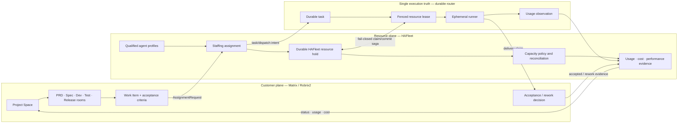

# PRD — HAFleet as a digital-labour resource plane

Version: 0.2
Status: **partly superseded — revision to 0.3 required.** See
[`../knowledge/decisions/adr-013-resource-contribution-console.md`](../knowledge/decisions/adr-013-resource-contribution-console.md).
Date: 2026-08-06

> **Supersession notice (2026-08-07).** ADR-013 is the amending record this PRD demands in §2.1 and
> §R0. It rules that HAFleet's user is the resource *contributor*, not a dispatching house.
> **Withdrawn:** the PDU/outsourcing-house product statement in §1, R0's `AssignmentRequest` /
> `StaffingAssignment` contract, `/api/dispatch` and any successor assignment path, and every
> staffing-request requirement that depends on them. Those requirements are not implementable and
> must not be scheduled until this document reaches 0.3.
> **Retained and now load-bearing:** R7 usage/cost accrual including A-R7-3's unknown-never-zero
> rule, R8's `Seat` / `SeatBinding` / `BillingSource` / `PriceBook` / `BudgetReservation` model, and
> R12's roster acceptance written against `mockup/`. Read §1–§9 with this notice applied.

## Evidence baseline

Current-state evidence and target governance are two different baselines:

- **Implementation baseline:** `agent-chat` `github/master@6dfe0a9960eeb7c0a728464750ca313958d929a3`
  (2026-08-04). Statements labelled `[implementation-baseline]` describe only this commit.
- Deployment data is not part of that Git baseline. Any observation from `data/agents.json` must be
  identified as a dated deployment sample, not as a product invariant.
- **Target-governance review checkout:** the following files have `status: Accepted` in the review
  checkout but are not present in the implementation baseline and were uncommitted at review time:
  `adr-011-backend-owned-ephemeral-runner-sessions.md`,
  `req-thread-scoped-agent-sessions.md`, `adr-012-agent-operations-client-access.md` and
  `req-agent-ops-client-access.md`. Statements labelled `[target-governance]` are proposed target
  constraints, not released implementation facts. Immutable commit SHAs must be recorded before
  this PRD can move from Draft to Accepted.
- **Re-verified against the working checkout (2026-08-05).** `knowledge/decisions/` contains
  `adr-001`…`adr-009` only. None of the four target-governance documents above is present here, so
  no claim depending on the durable router, thread-scoped sessions or the Agent Operations client
  contract can be checked from this repository. **`adr-010` is also absent**; its status must be
  recorded alongside the four above, or the gap in the sequence reads as a lost document.
- **Numbering resolved for the amending record only (2026-08-07).** The superseding ADR took
  **013**, the first identifier that cannot collide with the review checkout's `adr-011` and
  `adr-012`. `adr-010` remains unaccounted for and this does not close it. `adr-013` is present in
  this checkout with `status: Proposed`; it is `[target-governance]`, not a released implementation
  fact, and no claim resting on its five contracts can be checked here — none of them is built.

Current facts, current limitations, product decisions and target requirements are deliberately
separated below. Authentication middleware is treated as evidence of caller identity, not as proof
of domain ownership.

### Related documents

| document | relationship |
|---|---|
| [`../knowledge/decisions/adr-013-resource-contribution-console.md`](../knowledge/decisions/adr-013-resource-contribution-console.md) | **the amending record.** Withdraws the dispatch half of this PRD and fixes the next round's build order. Read it before §1 |
| [`PLAN-console-api-integration.md`](PLAN-console-api-integration.md) | the API gap inventory and phased plan implementing ADR-013's contracts. Records that eight endpoint groups, two field extensions and the integration layer itself are absent, and that `seat`/`quota` have zero occurrences in the baseline |
| [`design/hafleet-as-contribution-console.md`](design/hafleet-as-contribution-console.md) | the UX design ADR-013 distils, with the per-layer exists/absent grounding table behind every claim |
| [`design/hafleet-as-pdu.md`](design/hafleet-as-pdu.md) | the capability review this PRD rests on: per-function inventory with `file:line` evidence, and the three-memories diagnosis behind §6.5 |
| [`design/dashboard-relayout.md`](design/dashboard-relayout.md) | the console's information architecture, its invariants and its executable checks |
| [`../mockup/`](../mockup/) | a running Next.js prototype of the console. It already implements part of R12 and R14 and carries its own known-gaps list, so acceptance for those two requirements must be written against it rather than from scratch |

---

## 1. Release decision summary

### Target product statement

**HAFleet will be the resource plane and workforce manager for digital coding agents.** It will
connect agents wherever they run, record their identity and qualification, classify their role and
skills, manage capacity and commercial resources, accept scoped staffing requests from Matrix
Project Spaces, and return auditable assignments, execution state, usage and cost.

HAFleet is analogous to a digital-employee outsourcing house or PDU. The analogy defines its
responsibility for hiring, qualification, staffing, capacity, health, cost, performance evidence and
development. It does not make HAFleet the owner of the customer's product lifecycle.

### Release boundary

| release class | included | meaning |
|---|---|---|
| **Internal technical preview** | Phase 0–2 | assignment and staffing foundation; not yet a priceable PDU product |
| **PDU MVP beta** | Phase 0–3 code complete | durable staffing, roster, utilisation and cost accrual are available for a controlled pilot; no commercial SLA yet |
| **Commercial GA** | PDU MVP beta + controlled baseline period | price/invoice reconciliation, approved targets and operational/commercial SLAs are complete |
| **Later product waves** | Phase 4–5 | scoped team knowledge and evidence-based workforce assessment |
| **Explicitly out of PDU MVP** | autonomous HR sourcing, cross-organisation capacity market, multi-customer deployment, customer project workflow engine | requires separate product and isolation decisions |

Phases are implementation waves, not claims that every intermediate wave is a complete product.
The PDU MVP beta cannot begin its pilot until the Phase 0–3 release gates in §9 pass. Commercial GA
requires the additional pilot and reconciliation gates in §9.

---

## 2. Product boundary and ownership

### 2.1 Customer project plane

The customer decides how to run a project, divide the product process into phases, approve work and
accept delivery. These decisions are made through Matrix and surfaced by Robrix2/HAgency.

The target normative information model is:

- **Matrix Space = Project**: stable customer-facing project container and navigation root.
- **Child room = team or process surface**: PDT, PRD, architecture/SE, module spec/development,
  testing, release, marketing, sales or service.
- **Thread or durable task = Work Item**: a concrete discussion, request or unit of delivery.
- Room membership, power level and E2EE remain independent. A Space hierarchy is not automatically
  an authorisation boundary.

The PDU MVP beta may support a `room-as-project compatibility mode`, but every assignment must still carry a
stable `project_id` and an optional `project_space_id`. The compatibility mode must not become the
canonical data model.

At the implementation baseline, Accepted ADR-009 and REQ-PROJECT-BOARD define an HAFleet group as
the project-room/membership boundary. Phase 0 must accept an amending or superseding ADR and update
REQ-PROJECT-BOARD before `Matrix Space = Project` becomes normative. The migration must define
group compatibility, typed child-room bindings, nested/shared rooms, revocation, membership and
E2EE behaviour.

### 2.2 HAFleet resource plane

HAFleet owns:

- agent identity, connector and runtime offers;
- roles, skills, qualification evidence and eligibility;
- commercial resources such as seats, quota buckets and API billing sources;
- staffing assignments and capacity reservations;
- fleet health, resource usage, cost allocation and performance evidence;
- the operator/PDU-manager console.

HAFleet may publish resource status and delivery claims into Matrix. Those messages are projections,
not the authoritative project phase or acceptance decision.

### 2.3 Cross-plane objects

| object | system of record | purpose |
|---|---|---|
| `ProjectRef` and `ProjectWorkItem` | Matrix/Robrix2; anchored by authoritative Matrix events and versioned bindings | project identity, work intent, deliverables and acceptance criteria |
| `AssignmentRequest` | Matrix/Robrix2 creates `request_id` and authoritative source event; HAFleet stores a digest-pinned received copy | asks HAFleet for one qualified allocation under explicit scope |
| `StaffingAssignment` | HAFleet creates `assignment_id` | records who/what was assigned, why and under which commercial policy |
| `ExecutionDispatch` and `ResourceLease` | durable router | controls runner creation, fencing, capacity and at-most-once execution |
| `DeliveryAcceptanceObservation` | Matrix/Robrix2 creates the authoritative event; HAFleet stores a verified projection | records accepted or rework outcome; HAFleet cannot originate it |

---

## 3. Users and authorisation

| user | need | authorisation boundary |
|---|---|---|
| **PDU manager** | staffing, cost, utilisation and performance evidence | fleet-wide read; commercial and profile policy write |
| **Fleet operator** | onboard, start, stop, diagnose and intervene | operational write; no customer acceptance authority |
| **Project requester** | request qualified capacity and see assignment state | scoped to the Project Space/work item |
| **Project approver** | approve execution where required and accept delivery | Matrix membership/power policy plus approval contract |
| **Agent/runner** | read its assignment, authorised knowledge and tools | assignment-scoped capability; never a fleet-wide operator token |

PDU-manager and fleet-operator permissions must be distinct even if one person holds both roles in a
single-customer deployment. `requireBridgeSecret`, agent tokens and loopback/API tokens authenticate
callers; domain authorisation additionally requires project binding, full MXID, assignment scope and
the relevant Matrix membership/power policy.

---

## 4. Scope

### 4.1 In scope for the PDU MVP

- Connect, identify and qualify supported local coding agents.
- Classify agents by role, skills, service tier, runtime and eligibility.
- Represent shared plan seats, API billing sources, quotas and availability without treating a
  credential home as the commercial resource itself.
- Accept idempotent, project-scoped assignment requests.
- Use the durable router as the only execution truth.
- Persist staffing, capacity, usage and cost events through restart.
- Present a workforce roster and a thin, read-only project lens.
- Attribute cost and accepted outcomes to assignment and project.
- Default transcript/memory export to off or an approved local destination.

### 4.2 Deployment constraint

The PDU MVP is **single-customer / single-fleet**. It may contain multiple projects, and project
isolation is still required. It must not be deployed as a shared multi-customer service until tenant,
identity, knowledge, cost and retention isolation are specified and tested.

The product target supports local and remote resources. The initial durable thread-runner contract
supports only the runtime/runner combinations explicitly accepted by that contract. A remote agent
or framework is shown as `unsupported_for_assignment` until its transport, workspace, approval and
data-boundary semantics are accepted; it is not silently treated as equivalent to a local runner.

### 4.3 Out of scope for the PDU MVP

- Customer-owned PRD/spec/release workflow automation and acceptance authority.
- Autonomous sourcing or replacement of agents.
- Cross-organisation capacity exchange.
- Multi-customer deployment.
- Causal claims that a guidance change improved performance; the first version reports evidence and
  correlation only.

Credential material is not a HAFleet business object, but credential binding and security are in
scope. Plan login state should remain in its credential home. API-key mode currently requires the
backend to receive and inject secrets, so encrypted storage, redaction, rotation, access control and
audit are mandatory implementation concerns.

---

## 5. Verified current state

The table describes `agent-chat@6dfe0a9`; it does not imply that the mechanism satisfies the target
contracts.

| function | verified current fact | proven limitation |
|---|---|---|
| Connect | Five framework manifests and HAFleet ACP launch paths exist; ACP onboarding provisions an agent token, registers a profile and performs sustained health sampling | supported/launchable status differs by adapter; qualification is largely transport liveness |
| Classify | `lib/matrix-agent.js` defines six roles and three ordered tiers and can infer some roles from canonical names | onboarding paths do not explicitly populate role/capability; explicit roles are not fully validated; a skill dimension is absent and capability tier implies a fixed runtime/model mapping |
| Dispatch | `/api/dispatch`, selection, queue tickets and renewable leases exist | no first-party production caller was found — the only callers are `tests/api-dispatch.test.js`. Queue and leases are process-local **in-memory `Map`s** (`src/dispatch-lease-store.mjs` `_byId`/`_byAgent`; `backend-v2.js:8400-8401`), so a restart silently frees every lease and drops every queued ticket. `[target-governance]` this path conflicts with the proposed durable thread router if treated as a second execution truth |
| Monitor | agent task, ACTIVE/IDLE streaks, health, logs, alerts and supervisor signals exist | room/role/tier/task lease context is private and not durably queryable; current streak duration is not historical utilisation |
| Assess | supervisor events support intervention and incident history | incident signals do not equal accepted outcome quality or long-term performance |
| Learn | Letta integration and governed knowledge artifacts exist | hook migration is partial; knowledge is not assignment-scoped or served through the MCP surface; default remote endpoint creates a privacy hazard |
| Cost | **nothing.** Re-verified: the only `usage` symbols in `lib/`, `src/` and `backend-v2.js` are a CLI help function (`lib/codex-hook-trust.js:437`), a resource-budget alert string and `readLocalSwapUsageSnapshot()` — system swap, not LLM usage | there is no per-assignment workforce usage, price book, seat accounting or cost-allocation pipeline, and no adaptable existing field either. Cost accounting starts from zero |
| Project lens | the project page already renders separate specifications, issues and change requests with richer rows at this baseline | the bridge models one group to one room and has no canonical Project Space/project-room binding |

Dispatch is not described as “0% by construction.” Some agents can enter the legacy pool through
name-derived roles. The accurate product gap is that onboarding does not create an explicit,
validated qualification; no production requester drives the legacy dispatch API; and the legacy
queue/lease cannot provide durable execution guarantees.

At this baseline, nine ADRs and four requirements have Accepted status. Guidance, standards canon
and contextual documents are useful knowledge assets, but are not counted as Accepted ADR/REQ
artifacts.

---

## 6. Requirements

Priorities describe business necessity. Delivery phase describes dependency order; the two are not
interchangeable.

`R0` is a newly introduced foundation requirement. Existing R1–R20 identifiers are retained to
avoid silently changing external references; any downstream tracker must explicitly add R0.

### 6.1 Contract and privacy foundation

#### R0 — One assignment contract and one execution truth (P0)

HAFleet must accept an immutable, idempotent `AssignmentRequest` and create a durable
`StaffingAssignment`. Execution must be delegated to the target durable router; the legacy
`/api/dispatch` may be removed or retained only as an adapter into that router.

The existing Agent Operations owner-DM contract does **not** authorise project staffing requests.
Phase 0 must establish a separate Project Assignment Requester ADR/REQ. It binds requester and
device/event provenance, ProjectRef/binding version, room/work item, allowed command, expiry, nonce,
payload digest and revocation. Matrix-to-HAFleet delivery uses a durable inbox/outbox and replay
protection.

An assignment request contains at least:

- client-generated `request_id`, `project_id`, optional `project_space_id`;
- `room_id`, `thread_root_event_id`, `work_item_id`, existing durable `task_id`, authoritative source
  event/digest and requester full MXID;
- required and preferred roles/skills/service tier;
- compatible frameworks/runtimes and local/remote constraint;
- backend-pre-registered opaque references for repository, workspace, tools and write scope, plus
  data classification;
- priority, deadline, budget and estimated effort;
- deliverables, acceptance criteria and status destination;
- schema version and payload digest.

HAFleet generates `assignment_id` only after request validation. PDU MVP requests exactly one
allocation (`quantity = 1`). Multi-person demand later uses an explicit assignment group with child
assignments; it is not represented by one ambiguous lifecycle. Cancel and reassign are separate
idempotent commands/events, not mutable fields on the request.

The layers have separate state machines:

| layer | canonical states and invariants |
|---|---|
| Request reception | `received → validation_rejected or validated`; validation includes requester authority, binding version, durable task and confirmed Matrix anchor |
| Staffing assignment | `queued → staffed → executing → delivered → acceptance_pending → completed or rework_requested`; `cancelled` may occur before execution; `failed` records a known terminal failure; `outcome_unknown` blocks reassignment until inspection/resolution; `rework_requested` closes this assignment and creates a separately authorised successor request/assignment |
| Execution dispatch | `created → started → completed / failed / cancelled_before_start / outcome_unknown`; at-most-once applies to one `dispatch_id/generation`, never to the whole assignment |
| Resource hold/lease | `prepared → claimed → committed → released / expired / compensated`; expiry is a capacity event, not an assignment outcome |
| Delivery acceptance | authoritative Matrix event: `accepted` or `rework_requested`; HAFleet stores a source-event/digest-pinned observation and cannot originate or silently revoke it |

For PDU MVP the cardinality is:

`1 AssignmentRequest → 1 StaffingAssignment → 1 durable task → 1..N dispatch generations`

The first dispatch requires a pre-existing durable task and durably confirmed Matrix anchor. A
started dispatch is never replayed. Recovery after `outcome_unknown` first completes the required
inspection/resolution flow; `continue` creates a distinct successor dispatch with a higher fence and
predecessor reference. Dirty workspace/resource evidence cannot be bypassed by cancel or reassign.
A short-lived capacity lease remains subordinate to these objects and cannot replace their
lifecycles.

*Acceptance A-R0-1:* repeating the same `request_id` and digest produces the same assignment; a
different digest is rejected as a conflict.

*Acceptance A-R0-2:* a dedicated requester contract validates full MXID, device/event provenance,
ProjectRef/binding version, membership/power policy, nonce/expiry and request digest; a desktop
client never receives or submits a fleet operator token.

*Acceptance A-R0-3:* `assignment_id → task_id → dispatch_id/generation` and the confirmed Matrix
anchor are durable and uniquely queryable before execution begins.

*Acceptance A-R0-4:* restart between every runtime transition preserves state; the same started
dispatch generation is never replayed, while a resolved recovery uses a new dispatch and higher
fence.

*Acceptance A-R0-5:* stale runners can report only delivery claims; they cannot create acceptance
evidence, advance project state or bypass outcome inspection.

*Acceptance A-R0-6:* a verified Matrix acceptance/rework event references the assignment, task,
delivery digest, actor and binding version and is idempotently projected into HAFleet.

#### R20 — Memory and transcripts stay local by default (P0)

Subconscious/memory export is disabled by default or points to an approved local endpoint. Any
off-host destination requires explicit project-level opt-in, shows the endpoint and data classes,
and defines redaction, retention, deletion/export and audit behaviour. “Self-hosted” is not treated
as proof of safety.

*Acceptance A-R20-1:* a clean installation sends no prompt or transcript off-host.

*Acceptance A-R20-2:* enabling export requires an authorised project decision and records actor,
destination, scope, time and retention policy.

*Acceptance A-R20-3:* export uses an allow-list of permitted data classes and fails closed when
classification is unknown; size/attachment limits, audit sampling and deletion/export behaviour are
verifiable. Secret scanning is defence in depth, not a guarantee that arbitrary transcripts can be
made safe by redaction.

### 6.2 Connect, classify and qualify

#### R1 — Every employee receives an explicit classified profile (P0)

Every onboarding path records `primary_role`, `skills`, `service_tier`, `runtime_offer` and
`eligibility`. A missing classification produces `unassigned`, with the dispatch consequence
visible; name-derived role is migration assistance, not authoritative qualification.

*Acceptance A-R1-1:* supported onboarding commands accept profile inputs or a versioned profile
file, and the resulting profile is queryable.

*Acceptance A-R1-2:* an unassigned agent may be healthy but is ineligible for staffing.

#### R2 — Classification values are validated and extensible (P0)

Canonical MVP roles may use the existing six-role vocabulary, but role, skill and tier are separate
fields. Unknown canonical roles are rejected; custom roles require a namespaced taxonomy entry.
Skills carry level, evidence, verification time and optional expiry.

*Acceptance A-R2-1:* invalid roles and skills return a 400 with the accepted taxonomy/version.

*Acceptance A-R2-2:* existing off-vocabulary records are migrated or shown as
`classification_invalid`; no invisible seventh pool cell is created.

#### R3 — A profile can evolve without replacing employee identity (P1)

Role, skills, service tier, runtime offer and eligibility can be revised independently. Every change
is versioned and audited. Identity, authorised knowledge references and historical performance
remain linked without incorrectly carrying customer-private material to another project.

*Acceptance A-R3-1:* reclassification preserves `agent_id` and historical assignments.

*Acceptance A-R3-2:* an active assignment continues under its pinned qualification version unless
explicitly reassigned.

#### R4 — Hiring verifies eligibility and job competence (P0)

Process liveness, transport/tool operation and job competence are distinct evidence. Qualification
runs a versioned test appropriate to the advertised skill/runtime and records the result. An
ACP→MCP→reply check proves transport/toolchain operation; it does not by itself certify coding,
testing or review skill.

*Acceptance A-R4-1:* an agent can be `onboarded_unqualified`, `qualified` or
`qualification_expired`. Only qualified offers enter staffing.

*Acceptance A-R4-2:* evidence records test version, environment, result and validity period.

#### R5 — The dashboard shows what the host can connect (P1)

A detection endpoint reports framework presence, version, transport, launchability, credential
binding state, setup requirements, permission summary and qualification support without returning a
secret. Connection readiness and assignment eligibility are orthogonal fields, not one precedence
ordered enum.

*Acceptance A-R5-1:* `connection_state` is one of
`ready | needs_auth | needs_setup | absent`; `assignment_eligibility` is independently
`eligible | trial | non_launchable | unsupported`, with a stable reason/contract reference. An
unsupported adapter cannot render as assignment-ready merely because it is installed and
authenticated.

*Acceptance A-R5-2:* detection responses and UI text have i18n keys; translated labels do not clip
or lose the reason for an unavailable state.

#### R6 — Trial and unsupported adapters are explicit (P2)

Adapter status distinguishes `production`, `trial`, `non_launchable` and
`unsupported_for_assignment`, with a human-readable reason and the contract it lacks.

*Acceptance A-R6-1:* `codex` and `codex-acp` are not displayed as interchangeable peers while one
remains a trial/non-launchable transport.

The following state axes remain independent in APIs, scheduling and UI:

| axis | examples | answers |
|---|---|---|
| classification | `unassigned`, `classification_invalid`, valid taxonomy version | what work profile is declared? |
| qualification | `onboarded_unqualified`, `qualified`, `qualification_expired` | is there current evidence? |
| connection | `ready`, `needs_auth`, `needs_setup`, `absent` | can the connector operate? |
| assignment eligibility | `eligible`, `trial`, `non_launchable`, `unsupported` | may this offer receive this assignment? |
| capacity | `available`, `reserved`, `busy`, `throttled` | can the qualified offer take work now? |
| health | `healthy`, `degraded`, `unhealthy`, `unknown` | is the runtime functioning? |

No single enum or colour may collapse these axes; combinations and reasons remain inspectable.

### 6.3 Commercial resources and scheduling

#### R7 — Usage and capacity observations are durable (P0)

Building on R0's Phase 2 assignment/event ledger, HAFleet persists append-only capacity intervals
and per-execution usage observations. The records survive restart and contain
project/assignment/dispatch/agent/runtime/seat/workspace references, timestamps, observation
category, confidence and end reason.

Usage provenance is `reported`, `measured` or `unknown`. Tokens are recorded only where the provider
reports them; busy time is measured independently and is never converted into token cost without a
valid rate source.

*Acceptance A-R7-1:* a completed, failed or cancelled dispatch and a released, expired or
compensated resource hold/lease leave queryable history after restart.

*Acceptance A-R7-2:* duplicate framework callbacks do not duplicate usage or cost.

*Acceptance A-R7-3:* missing provider usage is rendered as `unknown` with measured busy time, never
as zero.

#### R8 — Seats and billing sources are independent resources (P0)

`Seat` is not stored as a string property that makes an agent the owner of capacity. The model
contains:

- `Seat`: provider, plan type, quota buckets, concurrency, status and observation confidence;
- `SeatBinding`: runtime offer/execution environment, seat, host/OS identity, credential-home
  fingerprint and validity interval;
- `BillingSource`: API account or commercial plan, currency and policy reference;
- `PriceBook`: provider/model rates, effective interval and version;
- `BudgetReservation`: assignment/project budget reserved and consumed.

A credential-home fingerprint is a deployment-keyed HMAC with key identifier and rotation policy;
it is neither a raw path nor a globally correlatable hash and never exposes the credential. API-key
mode nevertheless uses a secret and must follow the security controls in §4.

*Acceptance A-R8-1 (Phase 1):* agents sharing a seat consume one shared quota/concurrency model and are not
double-counted.

*Acceptance A-R8-2 (Phase 2):* HAFleet-owned agent/seat/budget holds and router-owned workspace/named-resource
leases use a durable fail-closed `prepare → claim → commit | compensate` saga with idempotency,
expiry, fences and restart reconciliation. Cross-store atomicity is not claimed; provider quota is
an external observation and cannot be locally locked.

*Acceptance A-R8-3 (Phase 1):* the deployment records whether the commercial plan permits the intended
automation/sharing use.

#### R9 — Scheduling is policy-driven, not tier-hardcoded (P1)

Eligibility is checked before optimisation. Mandatory skills, runtime, data, workspace and approval
constraints cannot be traded for cost. PDU MVP uses a stable lexicographic policy:
`security/qualification → observable quota → budget → configured cost-or-headroom preference →
stable tie-break`. Ordered service tier is not assumed to imply substitutability across unrelated
skills. More complex weighted optimisation is deferred until measurement supports it.

*Acceptance A-R9-1 (Phase 2):* every assignment result names the eligibility and optimisation policy version
and explains the selected offer or queue reason.

*Acceptance A-R9-2 (Phase 3):* plan scheduling accounts for every relevant quota bucket and preserves a
configured safety headroom; unknown quota does not masquerade as full capacity.

#### R10 — Throttled is distinct from unhealthy (P1)

Provider/quota exhaustion produces `throttled`, with reset time and confidence when known. It is
excluded from eligible capacity but remains operationally healthy unless independent health evidence
says otherwise.

*Acceptance A-R10-1:* timeout, health failure and quota exhaustion produce different states and
alerts.

*Acceptance A-R10-2:* reset reconciles capacity without requiring agent re-registration.

#### R11 — Cost is traceable to assignment and project (P0)

The primary allocation keys are `assignment_id`, `project_id` and cost centre. Space, room and thread
are trace context. PDU MVP uses one deployment currency, integer micros, explicit rounding, a static
versioned price book and a declared plan-allocation policy. API usage categories include provider,
model, input/output/cache/reasoning units where reported. Amount stages are `estimated`, `accrued`
(usage × policy/rate) and `invoiced`; `observed` describes usage evidence, not money.

Corrections use reversal/superseding events. A billing period can be closed only under an explicit
policy. Budget reservations declare hard-limit or warning semantics and define unknown-price,
overage, cancellation and release behaviour. Currency conversion and multi-currency accounting are
out of the PDU MVP.

*Acceptance A-R11-1:* every non-zero or unknown accrued cost can be traced to usage evidence,
rate/policy version, rounding rule and assignment.

*Acceptance A-R11-2:* room/project/agent/seat views aggregate the same ledger without silently
mixing `reported`, `measured` and `unknown`.

*Acceptance A-R11-3:* plan cost is allocated by a declared policy; “paid already” is not recorded as
zero marginal accounting cost.

*Acceptance A-R11-4:* provider invoices reconcile to accrued records with explicit coverage,
variance, correction and closed-period handling before Commercial GA.

### 6.4 Workforce console

#### R12 — The console is a workforce roster (P0)

The dashboard home for PDU managers and operators is organised around the workforce. Each agent row
shows identity, role/skills summary, qualification, runtime, availability, current assignment,
project, work item, elapsed time, health, quota state, utilisation and cost coverage.

The roster exists to answer the PDU's five standing questions about its staff, and each maps to a
column group:

| question | column group | requirement that supplies it |
|---|---|---|
| **在干什么** — what is each doing | current assignment, work item, runtime | R0, R1 |
| **给谁干** — for whom | project, Space/room trace context | R0, R14 |
| **干到什么地步** — how far along | assignment lifecycle state, elapsed time, external wait | R0, R15 |
| **成本开支** — at what cost | accrued cost, coverage, seat/quota state | R7, R8, R11 |
| **健康状态** — in what condition | health, availability, qualification validity | R4, R10, R13 |

An unavailable value is `—` with a reason such as `usage_unknown`, `not_yet_measured` or
`project_unbound`; it is never silently zero. Management and operational actions follow separate
RBAC. New labels and reason strings require i18n keys and layout verification.

A running prototype of this console exists at [`../mockup/`](../mockup/), specified in
[`design/dashboard-relayout.md`](design/dashboard-relayout.md). It already implements the roster
shell, the rail, the empty/loading/error state contract, the i18n and theme switches, and an
executable invariant suite. Acceptance for R12 is written against that prototype and its known-gaps
list, not from scratch.

*Acceptance A-R12-1 (Phase 2):* a manager can answer who is working, for which project/work item,
since when, under which runtime/seat binding and with what current health/availability; unavailable
history/cost is explained.

*Acceptance A-R12-2 (Phase 3):* the same row adds historical utilisation, quota confidence and
accrued-cost coverage reconciled to R7/R11.

*Acceptance A-R12-3:* an operator action cannot perform customer approval or delivery acceptance.

#### R13 — Utilisation is derived from durable intervals (P0)

Utilisation is derived from durable intervals, not current ACTIVE/IDLE streaks. The model separates:

- assigned/reserved time;
- runner busy time and productive execution time where observable;
- idle, offline, maintenance and throttled time;
- agent utilisation and seat utilisation.

The denominator uses declared availability, maintenance and quota policy. It is shown alongside SLA,
queue time and safety headroom rather than treated as the only optimisation target.

*Acceptance A-R13-1:* the UI states numerator, denominator, timezone and period.

*Acceptance A-R13-2:* a restart or released lease does not change historical results.

*Acceptance A-R13-3:* agent, role, seat, assignment and project aggregations reconcile to the same
interval ledger.

#### R14 — The project lens is thin and Space-aware (P1)

HAFleet presents an internal, read-only resource lens: assignments, agent-opened issues/change
requests, dirty worktrees, blocked work, spec drift, usage and cost. It links into the authoritative
Matrix Project Space for project discussion and decisions.

`ProjectRef` contains a stable `project_id`, optional Matrix `space_room_id`, binding version and
typed child-room bindings. The PDU MVP beta may configure these bindings manually; HAFleet never infers authority
from names or Space hierarchy alone. The feature cannot become normative until the Phase 0
ADR-009/REQ-PROJECT-BOARD amendment is Accepted.

*Acceptance A-R14-1:* multiple rooms aggregate as one project without merging membership or E2EE
policy.

*Acceptance A-R14-2:* issue and change-request rows retain provider, identifier, state, link and
check detail already available at the implementation baseline.

*Acceptance A-R14-3:* the page deep-links to Matrix and does not implement project acceptance.

### 6.5 Knowledge and workforce development

**Why these requirements exist.** 培养 here means self-evolution — an employee understanding the
project better over time, and the team remembering more — not model training. The per-agent half of
that loop already runs: a Letta-backed subconscious receives session start, each prompt and the full
transcript, maintains memory blocks, and injects guidance into the next prompt. What is missing is
everything *between* agents. There are three memories with no connections between them:

| memory | scope | store | read by |
|---|---|---|---|
| subconscious memory blocks | one agent, one project | Letta — remote by default | that agent's next prompt |
| `knowledge/` — 9 ADRs, 4 requirements, guidance, standards | the team | git-tracked markdown | whoever reads the file tree because an entry file said to |
| `docs/agent-knowledge.md`, `docs/progress.md` | one workspace | markdown | that agent only |

An agent's whole tool surface is eleven MCP tools (`lib/mcp-server-core.js`) — messaging, tasks and
identity — and **none of them reaches `knowledge/`**. So a lesson one agent learns stays private and
the next agent rediscovers it; a remote runner, whose host may not hold the repo tree, has no path to
the team's accepted decisions at all. R16 serves that knowledge under assignment scope, R17 opens the
promotion path from a private lesson to a governed artifact, R18 makes the accumulated profile
portable without leaking customer memory, and R19 reports on the loop without claiming causality.
Full evidence in [`design/hafleet-as-pdu.md`](design/hafleet-as-pdu.md) §5.

#### R15 — Performance is evidence-based and outcome-aware (P1)

Supervisor incidents remain operational evidence, not a quality score. R0 already records the basic
verified acceptance/rework observation needed for attribution; R15 adds the analytical performance
record joining assignment, acceptance/rework outcome, cost, duration, task class/complexity, external wait,
restart/incident history and pinned profile/model/guidance versions.

*Acceptance A-R15-1:* scorecards show sample size, confidence and missing data.

*Acceptance A-R15-2:* `cost per accepted outcome` and `time to accepted outcome` are stratified by
task class/complexity; agents are not directly ranked across unrelated roles.

*Acceptance A-R15-3:* external wait and project-caused blocks are separated from agent-caused
blocks.

#### R16 — Team knowledge is served through assignment scope (P1)

Knowledge objects carry project, audience, classification, Accepted status, version/supersedes,
digest, provenance, owner and retention. An agent receives an assignment-scoped capability to list
or read only the permitted artifact manifest/content. It cannot enumerate the entire repository or
another project's knowledge.

*Acceptance A-R16-1:* local and remote agents receive the same authorised project manifest without
requiring the repository tree to exist on the runner host.

*Acceptance A-R16-2:* owner-DM, unrelated-project and unaccepted proposal content are denied and
audited.

*Acceptance A-R16-3:* session start uses targeted retrieval and a context budget rather than
injecting every Accepted artifact.

#### R17 — Private lessons can be proposed as governed knowledge (P1)

Agents submit idempotent, project-scoped proposals through a restricted backend command. The command
validates path/type, schema and agent-spec lint. Human/PDT promotion produces a versioned Accepted
artifact; an agent never receives arbitrary repository write access.

*Acceptance A-R17-1:* proposal, review, rejection and promotion are auditable and preserve
provenance.

*Acceptance A-R17-2:* only promoted artifacts become eligible for R16 delivery.

#### R18 — Employee profiles are portable without leaking customer memory (P1)

Portable data includes generic identity, non-customer-specific qualification evidence and public
configuration history. Project transcripts, owner-DM content, customer knowledge and acceptance
records remain within their project/retention boundary. Export/import is encrypted, schema-versioned
and audited.

*Acceptance A-R18-1:* host/framework/model migration preserves generic identity and approved
qualification history.

*Acceptance A-R18-2:* exporting a profile cannot export project-private content without a separate
authorised project export.

#### R19 — Improvement evidence closes the loop without claiming causality (P2)

Guidance/knowledge/profile changes are versioned and linked to subsequent assignments. Reports show
before/after evidence with task mix, sample size and confounders. The product does not label a change
as causal improvement without a separately designed evaluation.

*Acceptance A-R19-1:* a reviewer can reproduce which configuration and guidance version served each
assignment and compare stratified outcomes.

---

## 7. Data and event model

| entity/event | system of record and responsibility | requirements |
|---|---|---|
| `ProjectRef` | Matrix/Robrix2 authority; project ID, Space ID, versioned typed room bindings, classification, revocation | R0, R14, R16 |
| `ProjectWorkItem` | Matrix/Robrix2 authority; source event, task/anchor, criteria digest, data class and binding version | R0, R14 |
| `AssignmentRequesterGrant` | project-requester authority, device/event provenance, commands, nonce/expiry and revocation | R0 |
| `AssignmentRequest` / received copy | client request ID and source event; HAFleet digest-pinned received copy, demand, budget, deliverables and idempotency | R0 |
| `StaffingAssignment` | HAFleet assignment ID, lifecycle, selected offer, policy/qualification versions and task mapping | R0, R9, R15 |
| durable `Task` / `ExecutionDispatch` | router-owned task, confirmed Matrix anchor, dispatch generation, predecessor and outcome inspection | R0 |
| `ResourceHold` / `ResourceLease` | HAFleet hold and router lease joined by saga ID, fence, expiry and compensation state | R0, R8 |
| `WorkspaceResourceRef` | router-owned opaque workspace/named-resource identity and lease policy | R0, R8 |
| `DeliveryClaim` | runner-originated artifact/status claim with dispatch generation and digest; never acceptance | R0 |
| `DeliveryAcceptanceObservation` | verified Matrix event, actor/power evidence, assignment/task/delivery digest, accepted/rework and version | R0, R11, R15 |
| `AgentProfile` / `RuntimeOffer` | identity, role, skills, service tier, runtime, environment, eligibility and versions | R1–R4, R18 |
| `TaxonomyVersion` / `SchedulerPolicy` | accepted vocabulary, deterministic eligibility/selection policy and tie-break | R2, R9 |
| `QualificationEvidence` | test/version/environment/result/expiry | R4 |
| `Seat` / `SeatBinding` | commercial capacity and time-bounded runtime/environment binding | R8–R10 |
| `BillingSource` / `PriceBook` | plan/API policy, provider/model/unit rates, currency, rounding and effective time | R8, R11 |
| `QuotaObservation` | provider bucket, consumed/remaining/reset, provenance and confidence | R9, R10, R13 |
| `BudgetReservation` / `CostCentre` | assignment/project hard-or-soft budget and allocation dimension | R8, R11 |
| capacity/activity interval event | reservation, busy/idle/offline/maintenance/throttled start/end/reason | R7, R13 |
| `UsageObservation` | provider units or measured time, provenance and callback idempotency | R7 |
| `CostRecord` | estimated/accrued/invoiced micros, rate/policy, reversal and allocation keys | R11 |
| `PerformanceEvidence` | acceptance/rework, task class, waits, incidents and pinned versions | R15, R19 |
| `KnowledgeArtifact` / access capability | project/audience/classification/status/provenance/retention and scoped access | R16–R18 |
| profile export/import audit | schema, encryption/key reference, scope, actor and tombstone/retention action | R18 |
| transcript-export decision/event | project opt-in, actor, endpoint, allow-listed data class, retention and audit | R20 |

The operational and accounting ledgers are append-only at the domain-event level. Corrections use
reversal/superseding events, not silent mutation. Privacy deletion uses policy-governed
tombstone/pseudonymisation and key destruction while retaining the minimum legally required audit
evidence; raw private content is not retained merely because the ledger is append-only.

---

## 8. Metrics

Metrics become release gates only when their baseline, target, owner and approval date are recorded.
`TBD` is an explicit decision debt, not an implied target.

| metric | formula and unit | window / inclusion rules | source | owner | availability / target decision |
|---|---|---|---|---|---|
| Eligible staffing SLA | eligible validated requests staffed within SLA ÷ eligible non-cancelled requests, % | rolling 7d/30d; invalid, unauthorised and pre-SLA requester cancellation reported separately | assignment ledger | PDU manager | measurable Phase 2; target after pilot |
| Staffing queue latency | `staffed_at - validated_at`, p50/p95 seconds | by role/skill/service tier; show queue reason | assignment ledger | Fleet operator | measurable Phase 2; target after pilot |
| Time to qualified | `qualified_at - onboarding_started_at`, p50/p95 minutes | setup/auth/user wait broken out | onboarding and qualification events | Fleet operator | measurable Phase 1; target before beta |
| Agent utilisation | policy-defined busy or assigned interval ÷ declared available interval, % | 7d/30d; maintenance/throttled denominator policy version shown | interval ledger | PDU manager | measurable Phase 3; target after pilot |
| Seat utilisation/headroom | consumed/reserved observable capacity ÷ usable capacity, % plus confidence | by quota bucket/window; unknown is excluded and counted as coverage gap | quota and lease observations | PDU manager | measurable Phase 3; target after pilot |
| Cost coverage | assignments with known accrued cost policy and evidence ÷ cost-bearing assignments, % | reported/measured/unknown coverage shown separately | usage and cost ledgers | CFO/PDU manager | measurable Phase 3; GA target TBD |
| Cost per accepted outcome | allocated accrued micros ÷ verified accepted outcomes, deployment currency/outcome | 30d; task-class stratification is Phase 5, so beta result is descriptive only | cost ledger + acceptance observations | CFO/PDU manager | basic Phase 3; decision-grade Phase 5 |
| Accepted throughput / rework | count of verified accepted and rework events; rework ÷ delivered, % | 7d/30d; external/project waits separate when Phase 5 evidence exists | acceptance observations | Project/PDU manager | basic Phase 2; enriched Phase 5 |
| Repeat-incident rate | repeated incident class after the relevant governed artifact was available ÷ comparable exposures, % | requires retrieval/citation coverage; never presented as causality | knowledge audit + incidents | PDU manager | Phase 4–5; target TBD |

Phase 3 code completion starts a controlled 30-day pilot for metrics available by that phase. Phase
4–5 metrics establish their own later baselines. Commercial SLAs must not be invented from the
current deployment sample.

---

## 9. Delivery plan and release gates

### Phase 0 — contracts, governance and privacy

Deliver governance and canonical fixtures, not the Phase 2 runtime:

- R0 schemas, separate layer state/transition tables, idempotency and fencing rules;
- Project Assignment Requester ADR/REQ;
- ADR-009 and REQ-PROJECT-BOARD amendment for ProjectRef/Space/typed-room migration;
- committed target router/client-governance baseline and compatibility mapping;
- fail-closed resource-hold/lease saga contract;
- R20 endpoint/data-class/retention policy and threat model;
- knowledge/RBAC capability schema and cross-project denial test plan.

Gate:

- governance documents, canonical fixtures, threat model and contract-test plan are Accepted at
  immutable commits by both repository owners;
- schemas define source of record, actor, idempotency, replay, fence and recovery for every layer;
- no schema accepts arbitrary local paths/commands or a desktop fleet-operator token;
- no clean installation sends prompts/transcripts off-host;
- the project migration never infers authorisation from Space hierarchy.

### Phase 1 — supply model and qualification

Deliver: R1–R6 profile/taxonomy, qualification and framework detection; R8 Seat/BillingSource schema,
keyed binding identifiers and migration; current roster fields independent of historical telemetry.

Gate:

- every dispatchable runtime offer is qualified and versioned;
- invalid/unassigned profiles are visible and cannot enter eligible capacity;
- shared seat bindings cannot be counted as independent commercial capacity;
- unsupported remote/framework combinations remain fail-closed;
- detection separates connection readiness from assignment eligibility.

### Phase 2 — durable staffing

Deliver: R0 assignment/task/dispatch implementation; durable assignment/event store and queue;
restart reconciliation; HAFleet hold ↔ router lease saga; deterministic eligibility/static-capacity
selection from R9; R12 Phase 2 roster; R14 Space-aware thin project lens; basic verified acceptance
projection.

Gate:

- restart at every assignment/dispatch/saga state preserves truth and compensation state;
- a started dispatch generation is not replayed; recovery uses a distinct dispatch and higher fence;
- dirty/outcome-unknown resources remain fail-closed until inspection/resolution;
- every result or queue state includes a stable reason and policy/qualification version;
- customer approval/acceptance cannot be performed from the workforce console;
- ProjectRef, requester and acceptance source events/digests are uniquely queryable.

### Phase 3 — telemetry and accounting (**PDU MVP beta code boundary**)

Deliver: R7 usage/interval observations; R10 throttling; R11 price book, cost accrual and allocation;
R13 utilisation; quota/cost/headroom selection from R9; R12 Phase 3 historical/cost columns.

Gate for controlled beta:

- completed/failed/cancelled assignments and released/expired/compensated holds remain queryable
  after restart;
- usage/cost duplicate callbacks are idempotent and corrections use reversal events;
- every displayed number has provenance or an explicit unknown reason;
- assignment/project/room/agent/seat aggregates reconcile to the ledger;
- hard/soft budget and unknown-price behaviour pass contract tests;
- security and i18n checks pass for all new console states and labels.

### Controlled pilot and Commercial GA

Run the PDU MVP beta for 30 days in a controlled single-customer deployment.

Commercial GA gate:

- metric baselines, targets, operating owner and alert thresholds are approved;
- accrued costs reconcile against provider invoices with approved variance/correction handling;
- price book, plan allocation, billing-period close and retention procedures are operational;
- recovery, backup and operator runbooks pass rehearsal;
- the commercial SLA states which values are reported, measured, estimated or unknown.

### Phase 4 — scoped organisational learning

Deliver: R16, R17 and privacy-safe R18 export/import.

Gate:

- cross-project and owner-DM knowledge access tests fail closed;
- remote runners receive only assignment-scoped knowledge;
- proposals cannot bypass human/PDT promotion;
- privacy deletion and append-only audit semantics pass policy tests.

### Phase 5 — assessment and improvement evidence

Deliver: R15, R19 and profile-evolution reporting from R3/R18.

Gate:

- scorecards show data coverage, task strata, sample size and confidence;
- project/external waits are separated from agent-caused delay;
- reports use correlation language unless a separate causal evaluation exists.

---

## 10. Traceability matrix

`TBD before approval` means this PRD is not yet an estimate or delivery commitment.

| requirement / acceptance | phase | data/API or governance dependency | planned test/gate | accountable role | estimate / status |
|---|---|---|---|---|---|
| R0 / A-R0-1 | 0 contract, 2 runtime | request SoR, digest and idempotency | CT/IT-R0-IDEMP | HAFleet + Robrix2 owners | TBD before approval |
| R0 / A-R0-2 | 0 | requester ADR/REQ, ProjectRef binding, replay protection | CT-R0-AUTH | Security + Matrix owner | TBD before approval |
| R0 / A-R0-3 | 0 contract, 2 runtime | assignment/task/dispatch/anchor mapping | CT/IT-R0-MAP | Router owner | TBD before approval |
| R0 / A-R0-4 | 0 contract, 2 runtime | dispatch generation, fence, recovery | IT-R0-RECOVERY | Router owner | TBD before approval |
| R0 / A-R0-5..6 | 0 contract, 2 runtime | claim/acceptance event contracts | CT/IT-R0-ACCEPT | Matrix + HAFleet owners | TBD before approval |
| R1 / A-R1-1..2 | 1 | AgentProfile | IT-R1-PROFILE | Fleet operator | TBD before approval |
| R2 / A-R2-1..2 | 1 | TaxonomyVersion and migration | CT/IT-R2-TAXONOMY | PDU manager | TBD before approval |
| R3 / A-R3-1..2 | 1 core, 5 reporting | versioned profile and pinned assignment | IT-R3-VERSION | HAFleet owner | TBD before approval |
| R4 / A-R4-1..2 | 1 | QualificationEvidence | E2E-R4-QUALIFY | Fleet operator | TBD before approval |
| R5 / A-R5-1..2 | 1 | detection API and i18n | CT/UI-R5-DETECT | HAFleet UI owner | TBD before approval |
| R6 / A-R6-1 | 1 | adapter status | UI-R6-ADAPTER | Fleet operator | TBD before approval |
| R7 / A-R7-1..3 | 3 | usage/interval ledger | IT-R7-LEDGER | Accounting telemetry owner | TBD before approval |
| R8 / A-R8-1,3 | 1 | Seat/Binding/BillingSource | CT/IT-R8-MODEL | PDU manager | TBD before approval |
| R8 / A-R8-2 | 0 contract, 2 runtime | hold/lease saga | IT-R8-SAGA | HAFleet + Router owners | TBD before approval |
| R9 / A-R9-1 | 2 | deterministic eligibility/static policy | CT/IT-R9-POLICY | Scheduler owner | TBD before approval |
| R9 / A-R9-2 | 3 | QuotaObservation | IT-R9-QUOTA | Scheduler owner | TBD before approval |
| R10 / A-R10-1..2 | 3 | quota and health observations | IT-R10-STATE | Fleet operator | TBD before approval |
| R11 / A-R11-1..3 | 3 | usage, price book, allocation | IT-R11-ACCRUAL | CFO/PDU manager | TBD before approval |
| R11 / A-R11-4 | GA | invoice reconciliation | RECON-R11-INVOICE | CFO | TBD before approval |
| R12 / A-R12-1,3 | 2 | current assignment/health and RBAC; existing prototype `mockup/` + `design/dashboard-relayout.md` | UI/E2E-R12-CURRENT, extending `mockup/scripts/check-invariants.mjs` | Dashboard owner | TBD before approval |
| R12 / A-R12-2 | 3 | utilisation/cost read models | UI/E2E-R12-HISTORY | Dashboard owner | TBD before approval |
| R13 / A-R13-1..3 | 3 | interval/availability policy | IT/UI-R13-UTIL | PDU manager | TBD before approval |
| R14 / A-R14-1..3 | 0 governance, 2 runtime | superseding project ADR/REQ, ProjectRef; existing project lens in `mockup/app/projects` | CT/E2E-R14-SPACE | Matrix + HAFleet owners | TBD before approval |
| R15 / A-R15-1..3 | 5 | acceptance, cost, waits and incident evidence | IT/UI-R15-SCORE | PDU manager | TBD before approval |
| R16 / A-R16-1..3 | 0 threat model, 4 runtime | scoped knowledge capability | SEC/E2E-R16-SCOPE | Knowledge + Security owners | TBD before approval |
| R17 / A-R17-1..2 | 4 | proposal command/promotion audit | E2E-R17-PROMOTE | Knowledge owner | TBD before approval |
| R18 / A-R18-1..2 | 4 | encrypted export/import and retention | SEC/E2E-R18-PORT | Security owner | TBD before approval |
| R19 / A-R19-1 | 5 | pinned configurations and stratified evidence | IT/UI-R19-EVIDENCE | PDU manager | TBD before approval |
| R20 / A-R20-1..3 | 0 | endpoint/data/retention policy | SEC-R20-EGRESS | Security owner | TBD before approval |

---

## 11. Deferred items

| item | reason | prerequisite for reconsideration |
|---|---|---|
| Autonomous HR sourcing | comparable qualification, cost and accepted-outcome evidence do not exist before the PDU MVP | R4, R7, R11, R15 plus a governed benchmark |
| Multi-customer deployment | tenant identity, knowledge, secrets, cost and retention isolation are not specified | separate tenancy ADR/REQ and isolation tests |
| Cross-organisation capacity market | Matrix federation does not define commercial capacity leasing or trust | protocol, commercial and trust decisions |
| Customer phase/stage engine | belongs to the customer project plane; workflow IDs are not a HAFleet lifecycle | separate Matrix/Robrix2 product decision |
| Causal guidance optimisation | observational before/after reports cannot establish causality | controlled evaluation design and sufficient samples |

Project Space and project-to-many-room binding are **not deferred**. They are Phase 0 identity and
attribution foundations even if the first binding is configured manually.

---

## 12. Decisions still required

These are the currently identified decisions and governance records; discovery may add more before
the PRD is Accepted.

| ID | decision / recommended default | accountable owner | status | due | unresolved impact |
|---|---|---|---|---|---|
| D01 | Assignment ingress uses a new Project Assignment Requester ADR/REQ, not Agent Operations owner-DM authority | Matrix + Security owners | proposed | Phase 0 | no authorised staffing entry point |
| D02 | Amend/supersede ADR-009 and REQ-PROJECT-BOARD for stable ProjectRef, Space and typed rooms | Matrix + HAFleet owners | proposed | Phase 0 | project identity/cost attribution cannot proceed |
| D03 | HAFleet hold and router lease use a fail-closed saga; no cross-store atomicity claim | HAFleet + Router owners | proposed | Phase 0 | capacity can leak or double-book across restart |
| D04 | Per-dispatch at-most-once, outcome inspection and rework/recovery state tables are canonical | Router + Matrix owners | proposed | Phase 0 | recovery can violate fencing or lose acceptance evidence |
| D05 | Support API and plan in the schema; enable only configured sources per deployment | PDU manager | proposed | Phase 1 | migration and cost capture scope uncertain |
| D06 | Model shared capacity; isolation is a deployment policy; credential home is not a seat | PDU manager + Security | proposed | Phase 1 | commercial capacity is double-counted |
| D07 | Choose production Codex transport from qualification/operational evidence; retain the other as trial until retired | Fleet operator | open | end Phase 1 | duplicate adapter/support burden |
| D08 | One deployment currency and integer micros for MVP; CFO owns allocation/close, engineering owns measurement provenance | CFO + PDU manager | proposed | start Phase 3 | cost records cannot reconcile |
| D09 | R20 uses allow-listed data classes, default off/local, policy retention and auditable deletion/pseudonymisation | Security owner | proposed | Phase 0 | privacy and ledger policies conflict |
| D10 | Collect a 30-day controlled baseline, then approve task-class targets and commercial SLA | PDU manager + Product owner | open | Commercial GA | no defensible SLA or commercial launch |

The following are proposed product decisions to approve with this PRD, not pre-existing governance:

- Matrix/Robrix2 is the customer collaboration surface; HAFleet Dashboard is the internal workforce
  and operator surface.
- Project identity is stable and Space-aware; room is trace/binding context, not the canonical
  project identifier.
- Cost is allocated first to assignment/project/cost centre; room/thread remain trace dimensions.
- Shared capacity is represented explicitly; credentials are not used as business identifiers.

---

## 13. Approval conditions

This PRD may move from Draft to Accepted only when:

1. The four target router/client-governance documents have immutable commits and are referenced in
   the evidence baseline.
2. A Project Assignment Requester ADR/REQ is Accepted; it does not reuse the Agent Operations
   owner-DM grant or expose the fleet operator token.
3. ADR-009 and REQ-PROJECT-BOARD are amended/superseded with ProjectRef/Space/typed-room migration,
   compatibility and authorisation semantics.
4. R0 schemas, request/assignment/task/dispatch/acceptance state mappings and per-dispatch recovery
   semantics are Accepted by both `agent-chat` and Robrix2 owners.
5. The HAFleet-hold/router-lease saga has a single source of truth for each resource, canonical
   fixtures and restart/compensation tests.
6. Credential/API-key handling and R20 data-flow/retention/deletion threat review are complete.
7. Phase 0–3 acceptance-to-test ownership and estimates replace every `TBD before approval` entry.
8. PDU MVP beta gates, controlled-pilot owner and Commercial GA reconciliation/SLA decisions are
   named and dated.
