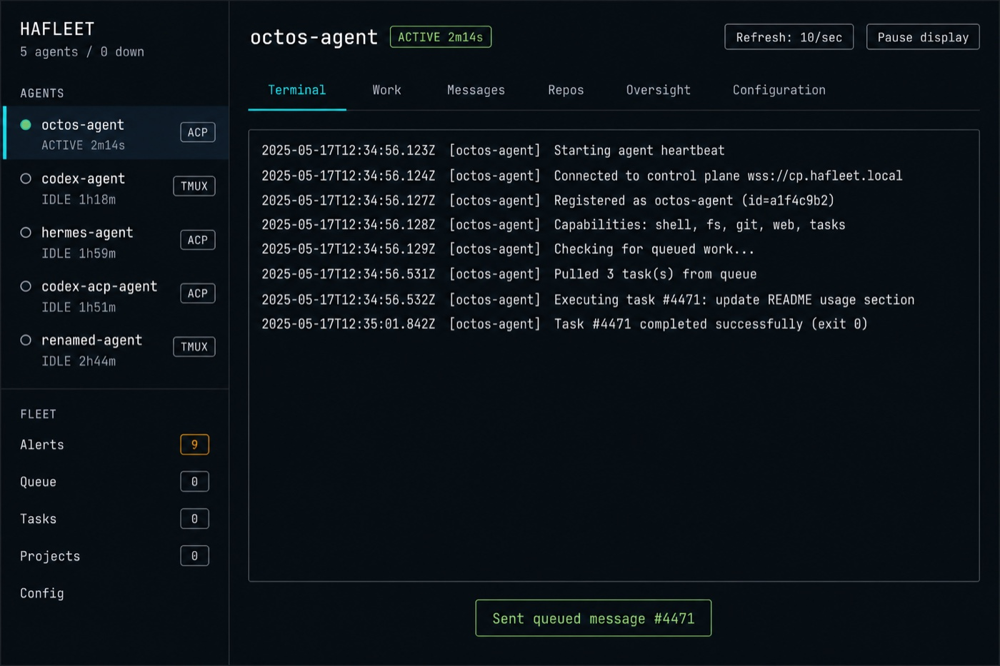
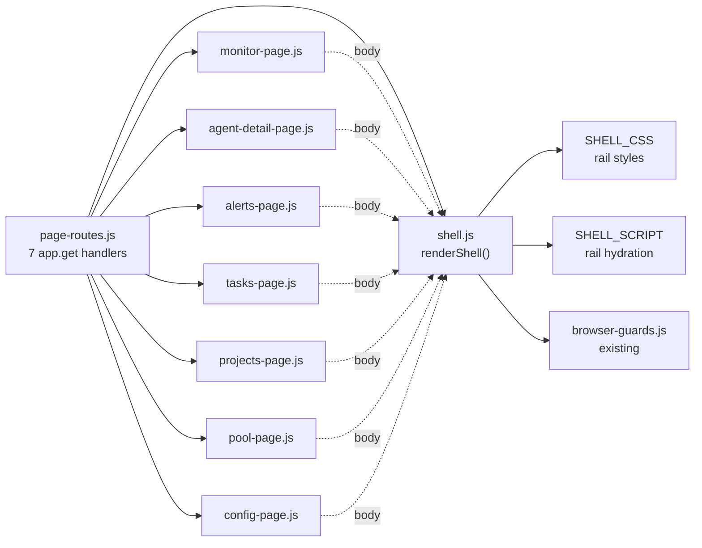
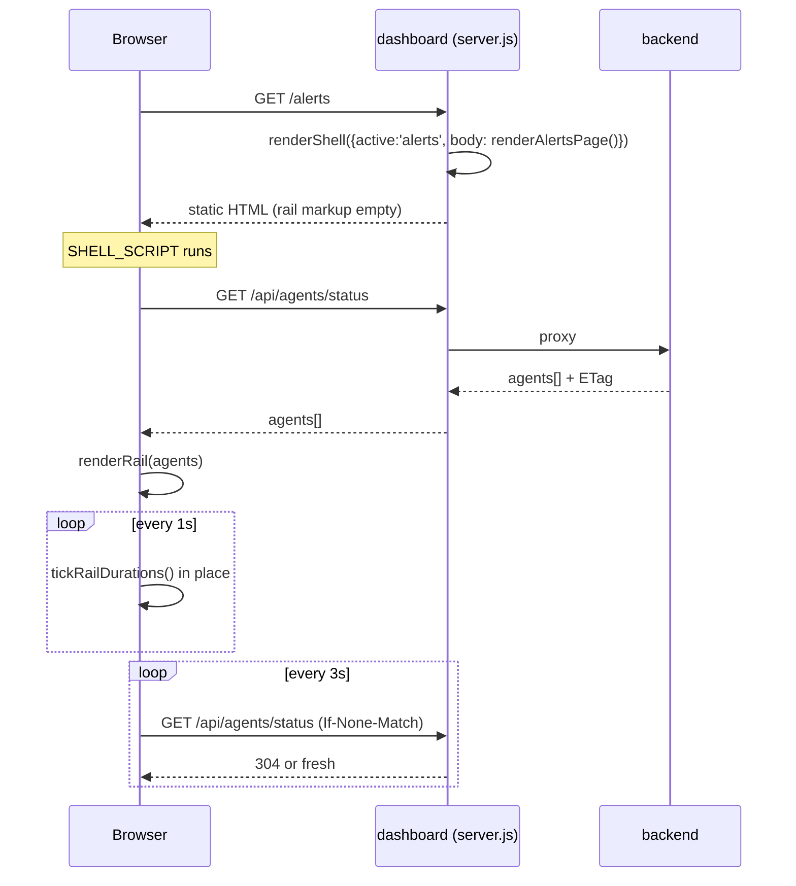
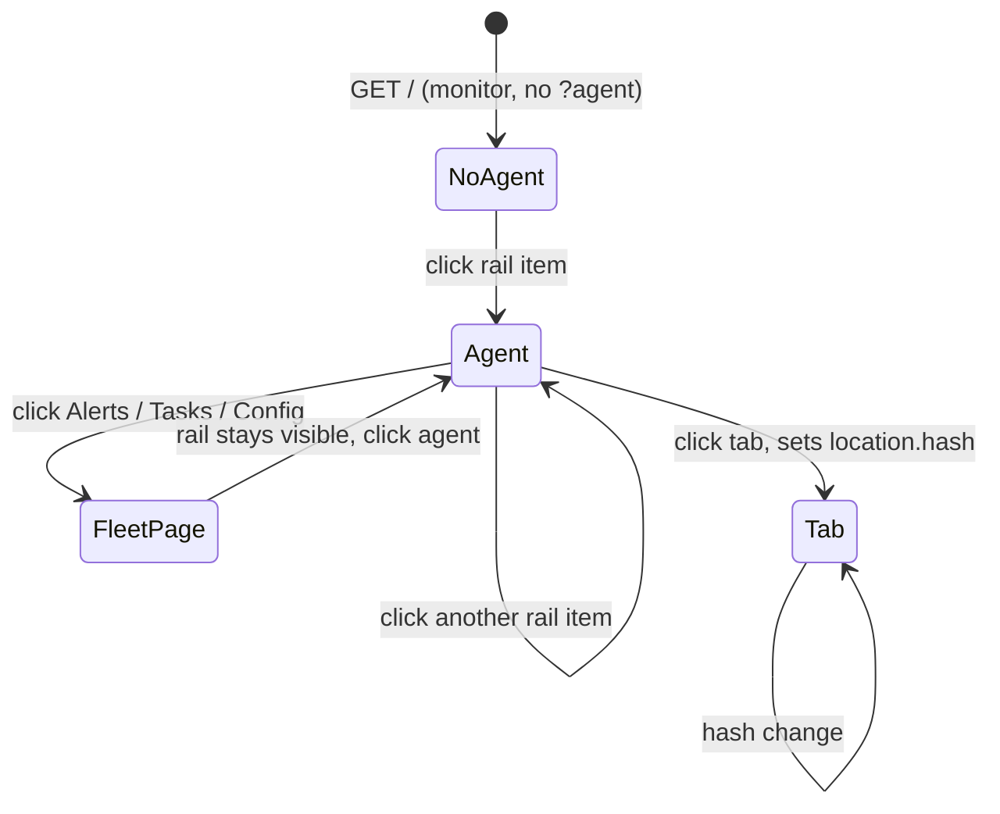
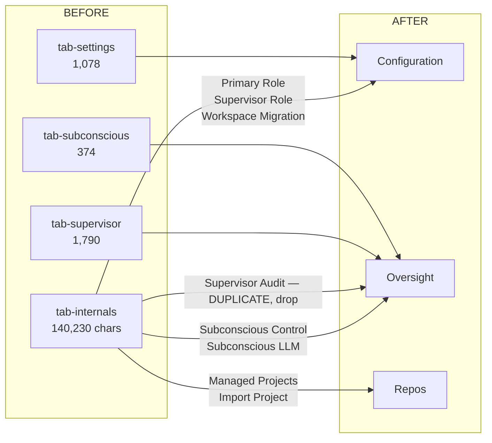

# Dashboard relayout — low-level design

Left-rail control layout over the existing server-side templating. No build step, no
framework, no new runtime dependency. Findings and scoring are in
[dashboard-ux-review.md](dashboard-ux-review.md).



The rail carries the fleet on every route; the main area is whatever is selected. Agents
become the primary axis because they are the only thing an operator operates. Every
destination shows its count, so an empty one is visibly empty rather than a wasted click.

> The mockup was generated from the spec below rather than drawn from the implementation,
> so treat it as intent, not as pixel truth. A
> [first pass](dashboard-relayout-first-pass.jpg) invented its own IA — aggregate
> counters in place of navigation, and tabs named `CONSOLE / METRICS / LOGS / DETAILS` —
> which is a useful illustration of how much the naming carries.

## Constraints taken as given

| | |
|---|---|
| Rendering | Server-side template literals returning whole HTML documents. 7 pages, 7,498 lines under `lib/dashboard/render/`. |
| Hydration | Each page inlines its own JS and CSS. No modules, no bundler. |
| Existing sharing | `browser-guards.js` exports `DASHBOARD_BROWSER_GUARDS_SCRIPT`, a template-literal string that 6 of 7 pages inline. The shell follows this exact pattern. |
| Routing | `lib/dashboard/page-routes.js`, 7 `app.get` handlers, each `res.type('html').send(renderXPage())`. |

## Module structure

One new module. The seven page renderers keep their signatures and their bodies; each
returns its body fragment to the shell instead of a whole document.



### shell.js public surface

```js
// lib/dashboard/render/shell.js
export function renderShell({
  active,      // 'agent' | 'alerts' | 'queue' | 'tasks' | 'projects' | 'config'
  agentName,   // string | null — highlights that agent in the rail
  title,       // document title
  head,        // page's own <style> and <link> markup
  body,        // page's own markup, dropped into <main>
  script,      // page's own inline JS
}) // -> complete HTML document string

export const SHELL_CSS    // rail + grid only; no page styles
export const SHELL_SCRIPT // rail hydration only; no page logic
```

The shell owns the rail and nothing else. It never touches a page's CSS or JS, so any
page can be relaid out later without the shell changing.

## Render sequence

The rail must show live agent state on *every* page, not just the monitor. It hydrates
client-side from the endpoint the monitor already uses, so there is no new server work
and pages stay static and cacheable.



`/api/agents/status`, its ETag handling, and the duration-tick pattern already exist in
`monitor-page.js`. The rail lifts `runtimeStatusText()`, `fmtSpanSec()` and the in-place
tick into `SHELL_SCRIPT`; the monitor then uses the shared copy instead of its own.

## Rail DOM contract

```html
<div class="app">                          <!-- grid: 242px 1fr -->
  <nav class="rail" aria-label="Fleet">
    <div class="rail-brand">…</div>
    <h2 class="rail-sec">Agents</h2>       <!-- real heading; page has none today -->
    <ul id="rail-agents">
      <li><a href="/agents/NAME" aria-current="page">
        <span class="glyph">●</span>
        <span class="nm">NAME</span>
        <span class="st" data-state-for="NAME">ACTIVE 2m14s</span>
        <span class="tag">ACP</span>
      </a></li>
    </ul>
    <h2 class="rail-sec">Fleet</h2>
    <ul><li><a href="/alerts">Alerts <span class="pill hot">9</span></a></li>…</ul>
  </nav>
  <main class="main">…page body…</main>
</div>
```

| decision | why |
|---|---|
| `<a href>`, not `<button>` | Agents already have real URLs (`/agents/:name`). Links give middle-click, bookmarking and keyboard nav for free; the current buttons give none. |
| `data-state-for` | Already shipped. The tick rewrites `textContent` only, so the list never re-sorts under the pointer. |
| `aria-current="page"` | Selection is currently a CSS class with no semantics. |
| `<nav>`, `<h2>`, `<ul>` | The monitor page has zero `h1`–`h4` today. This adds structure where it is cheapest. |
| Counts always rendered | `Tasks 0` / `Projects 0` — an empty destination should be visibly empty. Both are genuinely 0. |

### Grid and collapse

```css
.app  { display:grid; grid-template-columns:242px 1fr; min-height:100vh }
.rail { position:sticky; top:0; height:100vh; overflow-y:auto }

/* the terminal needs width more than the rail does */
@media (max-width:900px){ .app{ grid-template-columns:64px 1fr } .rail .nm,.rail .st{ display:none } }
@media (max-width:640px){ .app{ grid-template-columns:1fr } .rail{ position:static; height:auto } }
```

At 900px the rail becomes a glyph strip rather than disappearing, so fleet state survives
a narrow window. Below 640px it stacks.

## State

No new state. Selection already lives in the URL; the rail derives its highlight from
`location.pathname`. Tabs already sync to `location.hash` via
`setActiveTab(..., {updateHash})`.



The rail is present on every route, so agent state never leaves the screen.

## Dissolving Internals

One tab holds 140,230 of the page's 169,000 characters — 83% — under a name no operator
is looking for. It also contains **Managed Projects** (the whole Projects concept for an
agent) and a duplicate **Supervisor Audit**.

**Measured, and it changes the risk.** The Internals panel contains 43 element IDs; 31
are bound via `getElementById`, and **0 references depend on the `tab-internals`
ancestor**. Handlers bind by ID, not DOM position — so this is re-parenting `<section>`
nodes, not rewriting 140 KB. Mechanical, not risky.



| panel today | in tab | moves to |
|---|---|---|
| Identity, Guidance, Configuration, Framework Presets, Ownership | settings | **Configuration** |
| Primary Role, Supervisor Role, Workspace Migration | internals | **Configuration** |
| Create Task, Task Detail | tasks | **Work** |
| Direct Messages | dm | **Messages** |
| Managed Projects, Import Project | internals | **Repos** (new) |
| Docs Snapshot, Signal, Audit, Audit History | supervisor | **Oversight** |
| Subconscious, Subconscious Control, Subconscious LLM | internals + subconscious | **Oversight** |
| Supervisor Audit (2nd copy) | internals | **deleted** — keep the supervisor-tab one |
| System Controls (Stop / Remove) | settings | **page header**, beside the agent name |

Tab count stays at six, but every name is something an operator would look for and no tab
is a stub. `Terminal` becomes the default instead of `Settings`.

## Change plan

| # | change | files | risk |
|---:|---|---|---|
| 1 | Add `shell.js`; wrap all 7 routes | +1 new, `page-routes.js`, 7 renderers | low — additive, page bodies untouched |
| 2 | Move rail helpers out of `monitor-page.js` into `SHELL_SCRIPT` | `monitor-page.js`, `shell.js` | low — same functions, one home |
| 3 | Rename tabs; default to Terminal; add `role="tab"` | `agent-detail-page.js` | low — labels, hash values, ARIA |
| 4 | Re-parent Internals sections; delete the duplicate audit | `agent-detail-page.js` | moderate — mechanical, but do it alone |
| 5 | Retire `POOL` or rename it to what it holds | `pool-page.js`, shell | moderate — needs a decision on intent |
| 6 | Fold `/projects` under an agent; keep a fleet roll-up | `projects-page.js`, shell | moderate |

Steps 1–3 ship together as one reviewable change. Step 4 is its own PR. Steps 5–6 need a
product decision first: `POOL` is 63 lines and its purpose is not evident from the label
or the file.

## Invariants

Must still hold after every step:

- **Dirty-form preservation during periodic refresh** (`agent-detail-page.js`, `hasUnsavedDetailChanges()` -> `shouldPreserveDetailSettings()` -> `if (!shouldPreserveDirty) renderSettings(...)`).
  The detail page refreshes on a timer and skips the Settings re-render while edits are
  unsaved. A re-render that ignores this destroys whatever the operator is typing. Step 4
  moves DOM nodes, so this is the assertion to write first.
- **Selection round-trips through the URL** — `/agents/:name` and `?agent=` keep working;
  rail links are the same URLs.
- **Terminal poll machinery** — ETag reuse, request sequencing, visibility-aware rates,
  auto-scroll preservation, explicit Bottom.
- **Queue concurrency defenses** — hover locking, pending-action guards, tombstones,
  restore-on-failure. The outcome notice sits on top of these, not instead of them.
- **Stop vs Remove** stay separate, keep their confirmations and irreversible wording.
- **The 31 `getElementById` bindings** inside moved sections must still resolve; one
  duplicate ID would break silently.

## Tests

| assertion | guards |
|---|---|
| Every route's HTML contains `class="rail"` and `id="rail-agents"` | a page forgetting the shell |
| Rail markup is byte-identical across all 7 pages | the shell drifting per page |
| Every rail destination with a count renders it, including `0` | silent empty destinations returning |
| No element ID appears twice in the detail page | the re-parenting collision in step 4 |
| Every ID referenced by `getElementById` exists in the rendered output | a section moved out from under its handler |
| No tab panel is under 500 chars, and none exceeds 60% of the page | stub tabs, and a second Internals |
| Tab labels match an allow-list of operator words | `Subconscious` / `Internals` returning |
| Dirty-form preservation still referenced after step 4 | the invariant above |

The last three are a new kind of guard for this codebase: they assert IA properties
rather than behaviour, which is what regressed here in the first place.
