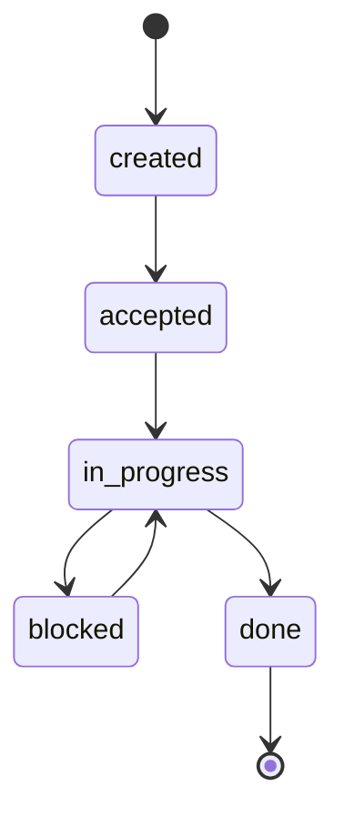
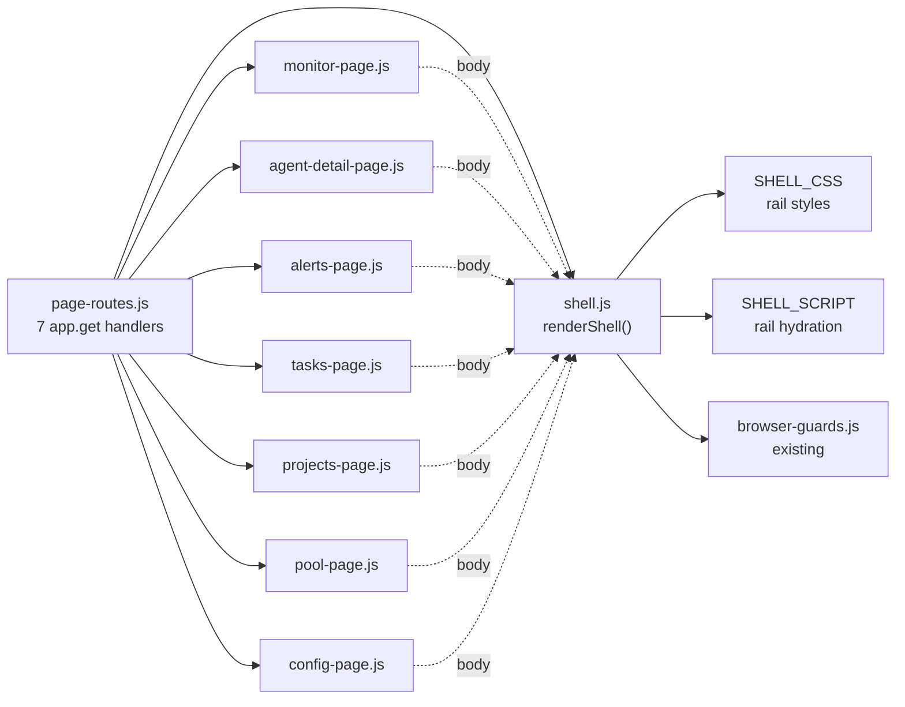
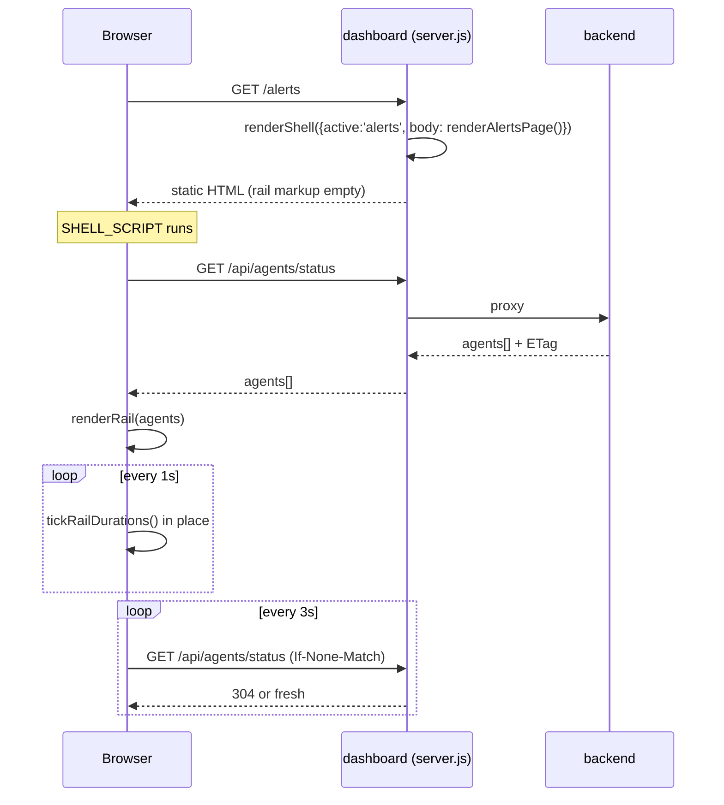
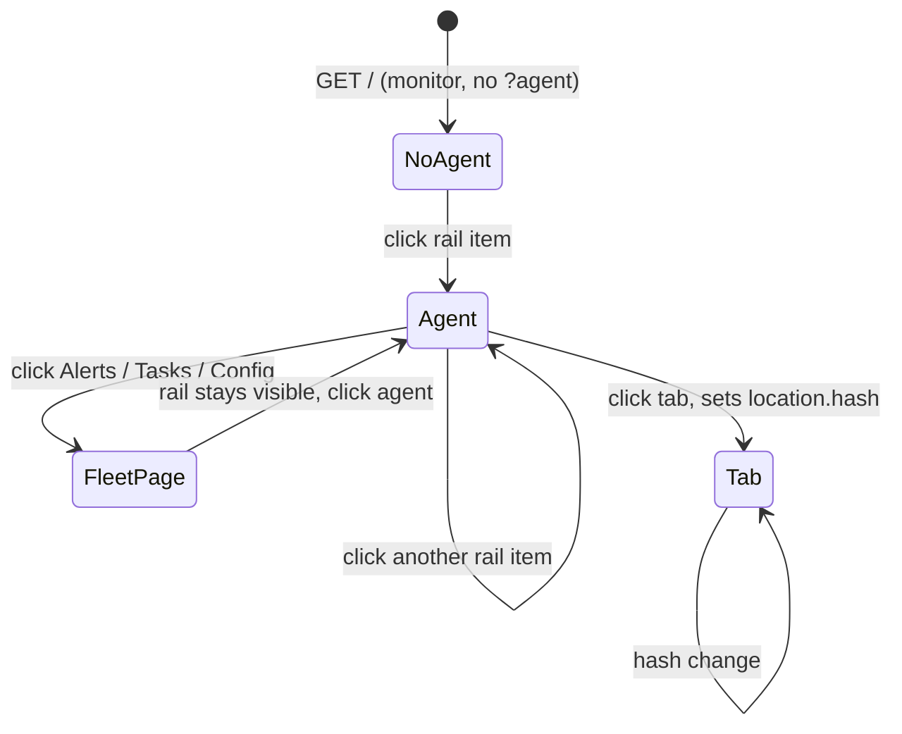
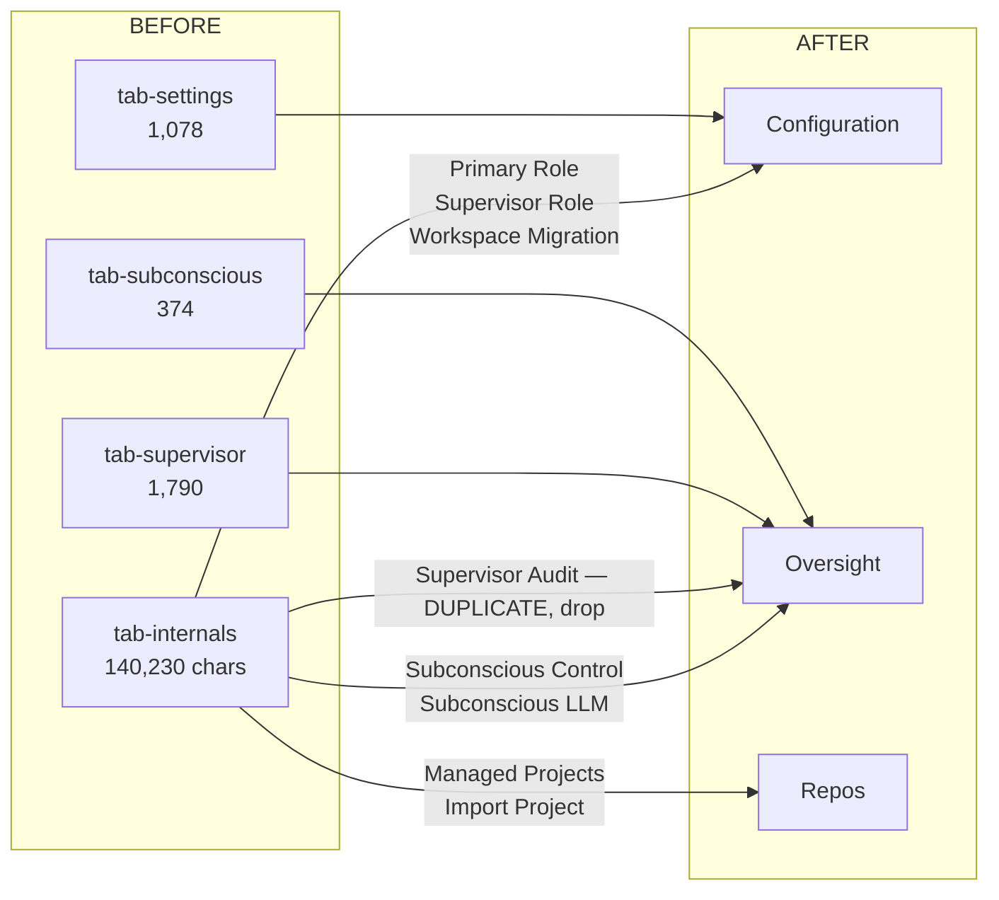

# Dashboard relayout — low-level design

Left-rail control layout over the existing server-side templating. No build step, no
framework, no new runtime dependency. Findings and scoring are in
[dashboard-ux-review.md](dashboard-ux-review.md).

## The seven pages

Light theme, Roboto for Latin with Open Sans SC for CJK. One shared rail; each body designed
for what an operator comes to that page to find out.

### /overview — Fleet overview *(new; did not exist)*

It lives at `/overview` while the migration table below is unfinished, and moves to `/` once
every monitor surface has a destination. The rail links `/overview` from day one so no route
changes twice. Until then `/` keeps rendering today's monitor unchanged — it is the default
landing page throughout, so it must not become a half-migrated hybrid.

Four counters, a *Needs attention* table ranked by severity, and recent activity. This is the
page round 1 was told it was missing: the old monitor opened on `NO AGENT SELECTED` and made
you click each agent to find trouble.

### /agents/:name — Agent detail

The first tab is **Activity**, not Terminal. Round 1 proposed Terminal and was wrong:
`grep -ci terminal agent-detail-page.js` returns **0**, and `octos-agent`, `hermes-agent` and
`codex-acp-agent` all have `tmux=None`, so three of five agents cannot show a pane at all. The
`ACP · no pane` pill and the inset notice state which source is being shown. **Stop/Remove are
exiled** to a separated *Agent actions* block, not placed beside the refresh controls.

#### Activity has three sources, and two of them need work

Round 2 caught that the mockup's notice — *"Showing its ACP session stream instead"* — invents a
data source. Verified: the only content endpoints are `/api/tmux/capture/:session` and the
generic dashboard SSE at `/api/stream`. `recentUpdates()` / `updatesSince()` exist **in the ACP
host process only**, and that host runs **no HTTP server**. So the round-1 error repeated itself
in new clothes: an impossible tab replaced by an impossible source.

What Activity actually resolves to:

| transport | source | status |
|---|---|---|
| tmux (`codex-agent`, `renamed-agent`) | `GET /api/tmux/capture/:session` | exists today |
| ACP (`octos-agent`, `hermes-agent`, `codex-acp-agent`) | tail of `data/services-local/logs/agent:<name>.log` | file exists (189 KB for octos); needs one read-only endpoint |
| neither / not started | empty state naming why, and a link to `hafleet acp-up` | to draw |

The ACP path is a log tail, not a protocol surface. That is deliberate: the host already writes
turn boundaries, tool names and agent output to that log — the work is one bounded-range file
read, not exposing `session/update` over HTTP. Freshness, byte cap and truncation marker must be
specified before it is built.

`Refresh: 10/sec` must not render for an ACP agent: it was pane-polling for tmux. The ACP path
polls the log at a lower fixed rate, and the control says so or is absent.

### /alerts — Triage

Preserves everything the current page already does well: the five-status stats strip, three
filters, severity-dotted list with occurrence counts and age, and a detail panel whose actions
are the legal transitions from the current status. Round 1 scored IA 10/100 having measured only
the monitor; this page was already good.

### /tasks — Fleet work list

Designed for its real state: empty. The empty panel says what a task *is* and offers the one
action, and the footnote states the count's denominator — `Showing open tasks only`. The lifecycle
is a branching state machine, not the linear strip the round-2 mockup drew:



`blocked` is a detour from `in_progress` and returns to it. Drawing it as a mandatory step
before `done` — which the mockup does — misstates the model.

### /projects — Project board

Round 1 called Projects "an attribute of an agent" and proposed folding it under one. That was
wrong: `projects-page.js` reads only `/api/project-board`. It is a fleet board — group selector,
members, five-lane task board, repos and worktrees with dirty state, local/remote specs, change
requests with check counts, activity. All of it survives.

### /pool — Capacity

Renamed from `POOL`, which named a data structure. The `idle/total` fractions and the three-item
legend make the axes legible. The closing notice is deliberate: if nothing makes dispatch
decisions from this page, it should be retired rather than redesigned.

### /config — Fleet configuration

Split into three separated sections by blast radius — presets, credentials, then agent lifecycle
behind a `destructive` marker. Masked credentials state what a blank field means, which is the
difference between "unchanged" and "cleared".

## Constraints taken as given

| | |
|---|---|
| Rendering | Server-side template literals returning whole HTML documents. 7 pages, 7,498 lines under `lib/dashboard/render/`. |
| Hydration | Each page inlines its own JS and CSS. No modules, no bundler. |
| Existing sharing | `browser-guards.js` exports `DASHBOARD_BROWSER_GUARDS_SCRIPT`, a template-literal string that 6 of 7 pages inline. The shell follows this exact pattern. |
| Routing | `lib/dashboard/page-routes.js`, 7 `app.get` handlers, each `res.type('html').send(renderXPage())`. |

## Typography and theme

| | |
|---|---|
| Latin | Roboto, weights 400/500 |
| CJK | Open Sans SC, weights 400/600 |
| Monospace | system stack, log and code panels only |

Fonts are self-hosted `woff2` under `public/fonts/` with `font-display:swap` and a
`unicode-range` split so CJK is fetched only when CJK is rendered. No CDN: the dashboard is
reachable on hosts with no outbound network, and a font CDN would make type a availability
dependency. Self-hosting adds asset files, not a runtime dependency, so the no-build-step
constraint holds.

Light palette: `#ffffff` page, `#f6f7f9` panels, `#e3e6ea` rules, `#1f2933` text, `#69737d`
secondary, `#1a73e8` accent, `#188038` / `#b06000` / `#c5221f` for healthy / warning / critical.
Semantic colour is never the only signal — every state also carries a word.

## Module structure

One new module. The seven page renderers keep their signatures and their bodies; each
returns its body fragment to the shell instead of a whole document.



### shell.js public surface

```js
// lib/dashboard/render/shell.js
export function renderShell({
  active,      // 'overview' | 'agent' | 'alerts' | 'tasks' | 'projects' | 'capacity' | 'config'
               // Seven, matching seven registered routes. Round 1 listed 'queue', which has no
               // handler, and omitted 'pool'/'capacity', which does. A rail destination with no
               // route is a dead link the tests must catch.
  agentName,   // string | null — highlights that agent in the rail
  title,       // document title
  head,        // page's own <style> and <link> markup
  body,        // page's own markup, dropped into <main>
  script,      // page's own inline JS
}) // -> complete HTML document string

export const SHELL_CSS    // rail + grid only; no page styles
export const SHELL_SCRIPT // rail hydration only; no page logic
```

The shell owns the rail and nothing else. It never touches a page's CSS or JS, so any
page can be relaid out later without the shell changing.

## Render sequence

The rail must show live agent state on *every* page, not just the monitor. It hydrates
client-side from the endpoint the monitor already uses, so there is no new server work
and pages stay static and cacheable.



`/api/agents/status`, its ETag handling, and the duration-tick pattern already exist in
`monitor-page.js`. The rail lifts `runtimeStatusText()`, `fmtSpanSec()` and the in-place
tick into `SHELL_SCRIPT`; the monitor then uses the shared copy instead of its own.

## Rail DOM contract

```html
<div class="app">                          <!-- grid: 242px 1fr -->
  <nav class="rail" aria-label="Fleet">
    <div class="rail-brand">…</div>
    <h2 class="rail-sec">Agents</h2>       <!-- real heading; page has none today -->
    <ul id="rail-agents">
      <li><a href="/agents/NAME" aria-current="page">
        <span class="glyph">●</span>
        <span class="nm">NAME</span>
        <span class="st" data-state-for="NAME">ACTIVE 2m14s</span>
        <span class="tag">ACP</span>
      </a></li>
    </ul>
    <h2 class="rail-sec">Fleet</h2>
    <ul><li><a href="/alerts">Alerts <span class="pill hot">9</span></a></li>…</ul>
  </nav>
  <main class="main">…page body…</main>
</div>
```

| decision | why |
|---|---|
| `<a href>`, not `<button>` | Agents already have real URLs (`/agents/:name`). Links give middle-click, bookmarking and keyboard nav for free; the current buttons give none. |
| `data-state-for` | Already shipped. The tick rewrites `textContent` only, so the list never re-sorts under the pointer. |
| `aria-current="page"` | Selection is currently a CSS class with no semantics. |
| `<nav>`, `<h2>`, `<ul>` | The monitor page has zero `h1`–`h4` today. This adds structure where it is cheapest. |
| Counts always rendered | `Tasks 0` / `Projects 0` — an empty destination should be visibly empty. Both are genuinely 0. |

### Grid and collapse

```css
.app  { display:grid; grid-template-columns:242px 1fr; min-height:100vh }
.rail { position:sticky; top:0; height:100vh; overflow-y:auto }

/* Fleet nav is pinned so a long agent list cannot push it below the fold. */
.rail        { position:sticky; top:0; height:100vh; display:grid; grid-template-rows:auto auto 1fr auto }
.rail-agents { overflow-y:auto; min-height:0 }   /* only this region scrolls */
.rail-fleet  { border-top:1px solid var(--line) } /* always visible */

/* At 900px keep the STATUS, drop the tag. Round 1 hid .st and then claimed
   "fleet state survives" — it did not; only indistinguishable dots survived. */
@media (max-width:900px){
  .app{ grid-template-columns:150px 1fr }
  .rail .tag{ display:none }
  .rail .nm{ overflow:hidden; text-overflow:ellipsis; white-space:nowrap }
}
@media (max-width:640px){ .app{ grid-template-columns:1fr } .rail{ position:static; height:auto } }
```

At 900px the rail narrows to 150px and drops the transport tag, keeping the name (truncated) and
the status text — the two things the rail exists for. Below 640px it stacks.

## State

No new state. Selection already lives in the URL; the rail derives its highlight from
`location.pathname`. Tabs already sync to `location.hash` via
`setActiveTab(..., {updateHash})`.



The rail is present on every route, so agent state never leaves the screen.

## Dissolving Internals

One tab holds 140,230 of the page's 169,000 characters — 83% — under a name no operator
is looking for. It also contains **Managed Projects** (the whole Projects concept for an
agent) and a duplicate **Supervisor Audit**.

**Measured, and it changes the risk.** The Internals panel contains 43 element IDs; 31
are bound via `getElementById`, and **0 references depend on the `tab-internals`
ancestor**. Handlers bind by ID, not DOM position — so this is re-parenting `<section>`
nodes, not rewriting 140 KB. Mechanical, not risky.



| panel today | in tab | moves to |
|---|---|---|
| Identity, Guidance, Ownership | settings | **Profile** |
| Configuration (effective runtime), Framework Presets | settings | **Runtime** |
| Primary Role, Supervisor Role, Workspace Migration | internals | **Runtime** |
| Create Task, Task Detail | tasks | **Work** |
| Direct Messages | dm | **Messages** |
| Managed Projects, Import Project | internals | **Repos** (new) |
| Docs Snapshot, Signal, Audit, Audit History | supervisor | **Oversight** |
| Subconscious Control, Subconscious LLM | internals | **Runtime** — they are controls |
| Subconscious (status only) | subconscious | **Oversight**, renamed Guidance path status, read-only |
| Supervisor Audit (2nd copy) | internals | **deleted** — keep the supervisor-tab one |
| System Controls (Stop / Remove) | settings | **separated *Agent actions* block**, below the panel |

Tab count goes six to **seven**: `Configuration` was doing two unrelated jobs and splits into
`Profile` and `Runtime` — see the content map above. Every name is now something an operator
would look for, and no tab is a stub. `Activity` becomes the default instead of `Settings`.
Round 2 presented six balanced tabs as a virtue; it was a size test, not a task model.

## Agent tabs — content map

Both reviewers called `Oversight` and `Configuration` junk drawers in every round, and they were
right: the round-2 tab set was six balanced *sizes*, not six coherent tasks. Specified by codex,
adopted as written. It is **seven** tabs, because `Configuration` was doing two unrelated jobs.

Final set: **Activity · Work · Messages · Repos · Profile · Runtime · Oversight**

The governing rule: *Oversight is read-only. Controls must not sit beside the evidence used to
judge them.*

### Profile — who is this agent, who owns it, what intent should it follow

Identity, then Guidance, then Ownership. One `Save profile` boundary across all three, with dirty
and last-saved state. Framework, model, roles, automated controls, audit evidence, migration and
presets do **not** belong here.

### Runtime — how is it launched, and which automated systems shape it

1. Effective runtime — framework, transport, server, model, reasoning, workspace. Effective values first.
2. Framework preset — the applied preset and its resolved values; global preset CRUD links to fleet Config.
3. Roles — Primary, then Supervisor; show desired vs effective when they differ.
4. Supervisor control — enable, cadence, policy. Controls only.
5. Subconscious control — desired state, authoritative vs fallback mode.
6. Subconscious LLM — provider, model, endpoint, key-env *reference* and resolution status. Never the secret.
7. Workspace migration — last, collapsed, marked disruptive, with preview, confirmation and outcome.

Saves are per subsystem: runtime/preset/roles, Supervisor, Subconscious/LLM. Migration is an
action, never a save field. Signals, audit, Stop/Remove and global presets do not belong here.

### Oversight — does this agent need intervention, and what did oversight already do

1. Current assessment — Supervisor Signal, severity, reason, lifecycle, evaluated-at, freshness, recommended action. Disabled or stale state comes *before* history.
2. Current work evidence — Supervisor Docs Snapshot, with an explicit warning that it is not the canonical Task.
3. Guidance path status — renamed from `Subconscious`. Read-only: active path, stage, last invocation, degraded pieces. "Configure" links to Runtime; no toggles here.
4. Recent supervisor decisions — Supervisor Audit, newest first.
5. Audit history — filterable full history.

Supervisor Audit and Audit History are **two views of one canonical event collection**, not the
duplicate the round-1 measurement found. Raw dumps go in a collapsed Diagnostics drawer under
Runtime, or are dropped.

## The ACP activity-log endpoint

Activity needs this for the three ACP agents. Contract specified by codex; the security properties
are the point.

```
GET /api/agents/:name/activity-log?limit=200&cursor=OPAQUE
```

**Name to path, safely.** Decode once; reject NUL, slashes, dot segments, controls, or anything
outside `^[A-Za-z0-9][A-Za-z0-9_-]{0,127}$`. Resolve against the registered-agent inventory —
unknown is 404, and no path is ever constructed for an unregistered name. Build exactly
`agent:<CANONICAL>.log` under the configured absolute log root. Open only a regular non-symlink,
`O_NOFOLLOW` where available, and re-verify `realpath(file)` is still under `realpath(root)` after
open. **No path, filename or raw offset is ever a request parameter, and the host path never
appears in a response.**

**Cursor, rotation, truncation.** The cursor is server-issued authenticated state — version,
device, inode, next offset, prior size — expiring in 24h, so a client cannot author an offset. Same
inode with `size >= offset` appends; `size < offset` returns `resetReason: truncated`; a changed
device or inode returns `resetReason: rotated`. Both cases mean the UI replaces rather than appends,
and says so. Partial trailing lines are withheld until complete. Order is oldest-to-newest. An
invalid cursor is `400 invalid_cursor`, never a guessed read.

**Sanitising, before budgeting.** UTF-8 with replacement; strip ANSI and OSC escapes and C0
controls except tab and newline — the real log is saturated with them. Cap 8 KiB per line and mark
clipped; 128 KiB response budget; report `truncated` at either cap. Redact values whose key matches
`api_key`, `apikey`, `token`, `secret`, `password`, `credential`, `authorization` or `cookie`.

**Labelling.** The UI says *"Agent log"* and states it is the supervisor's log for this agent, not
a complete work history. A missing log for a known agent is `200` with `state: empty` and
`reason: log_not_found`, not an error.

## Alerts summary strip

Round 2: the strip mixed four lifecycle statuses with one severity metric, and omitted `resolved`.
Two strips, one dimension each:

- **Status** — `open`, `acknowledged`, `assigned`, `suppressed`, `resolved`
- **Severity**, of the open set only — `critical`, `warning`, `info`

The rail pill counts **open** and says so (`9 open`), matching the first cell of the status strip.
A pill that disagrees with the strip the operator reads on arrival is worse than no pill.

## Populated Tasks

Round 3: a task system cannot be judged from an empty state. Specified by codex.

**Header** `Tasks — N open / M total`. Filters: Assignee, Status (default Open), Priority, text
search. *Open* means every status except `done`.

**Columns** status word badge · priority `P0`–`P3` · title with short ID and parent beneath ·
assignee or `Unassigned` · waiting/heartbeat (blocked shows reason and until or `OVERDUE`;
in-progress shows heartbeat age or `STALE`; otherwise em dash) · updated, relative with an exact
accessible timestamp.

**Ordering, blocked first:** bucket `blocked → in_progress → accepted → created`, then priority
`P0→P3`; blocked ties break on overdue, then earliest `waiting_until`, then oldest `updated_at`.
`done` orders by `completed_at` descending. `BLOCKED` and `OVERDUE` appear as words, not colour.

**Detail** master/detail wide, full-width with Back when narrow. Row click sets `?task=ID`. Renders
only *legal* transitions — Accept, Start work, Mark blocked, Resume, Mark done — with blocking
collecting its required waiting metadata. Actions stay in-flight until confirmed; failure keeps the
prior state. Delete is separated, confirms ID and title, and is never optimistic. Comment drafts
survive refresh.

**Shared contract, so Tasks and Work cannot drift.** Both consume one `TaskDTO` matching
`task-store` exactly — `id, title, description, status, priority, granularity, assignee,
created_by, created_at, updated_at, started_at, completed_at, heartbeat_at, waiting_reason,
waiting_until, parent_id, labels, health, comments` — through one shared renderer. Agent *Work* is
the same view with a locked `assignee=<agent>` scope plus "View all fleet tasks"; it is not a fork.
One definition owns status labels, the Open predicate, priorities, legal transitions, the stale
threshold, sorting, time formatting, URL selection, in-flight state and draft preservation. Contract
tests render one DTO through both scopes and assert identical output.

This also settles the naming complaint from round 2: `Work` is a *scope* of Tasks, not a third name
for the same objects.

## States every page must draw

Round 2's standing objection: only happy paths are drawn. Each page owes four states.

| page | loading | empty | error | in-flight action |
|---|---|---|---|---|
| Overview | counters skeleton, table placeholder rows | "Nothing needs attention" with last-checked time | per-card failure, other cards still render | n/a, read-only |
| Agent detail | tab frame with panel skeletons | Activity: no pane and no log; Work/Repos: scoped empties | source named in the failure: pane vs log vs backend | button disabled + spinner, outcome notice |
| Alerts | stats strip skeleton, 3 list placeholders | "No alerts match these filters" + a reset link | keep last good list, banner above it | transition button busy, row stays until confirmed |
| Tasks | table skeleton | drawn — states its denominator | banner, filters remain usable | create/edit/comment each own their button |
| Projects | per-section skeletons, independent | "No project groups" + how to create one | per-section failure; one dead section must not blank the board | Refresh busy state |
| Capacity | grid skeleton | "No agents report capabilities" | banner | n/a, read-only |
| Config | section skeletons | presets empty, credentials unset | per-section, never a whole-page white screen | Save busy; blank-means-unchanged restated |

Two rules across all seven: a failed refresh keeps the last good data and says it is stale, and
no destructive action is optimistic.

## Accessibility contract

Round 2 called `role="tab"` alone fake accessibility. It is. The tab set owes all of:

- `role="tablist"` on the container, `role="tab"` + `aria-selected` + `aria-controls` per tab,
  `role="tabpanel"` + `aria-labelledby` per panel
- roving `tabindex`: selected tab `0`, others `-1`; Left/Right/Home/End move selection
- selection mirrored to `location.hash`, Back returns to the previous tab, focus follows
- rail: `<nav aria-label="Fleet">`, `aria-current="page"` on the active destination,
  `<a href>` so middle-click and bookmarking work
- every state carries a word, never colour alone — this is the rule the round-2 Overview mockup
  broke, showing a red dot labelled `info`
- action outcomes announced through one `role="status" aria-live="polite"` region
- visible focus ring on every interactive element; no `outline:none` without a replacement

## Benchmark, replacing the score

Round 2 was right that 34/100 is theatre — no weights, no anchors, no protocol. Replace it with
timed tasks against a seeded fleet, three operators, median of three runs:

| # | task | today | target |
|---|---|---|---|
| 1 | Name every agent that is active, and for how long | click each agent | ≤ 10s, no clicks |
| 2 | Find the oldest unresolved alert and say which agent it is on | 2 clicks + scan | ≤ 15s |
| 3 | Find the one blocked task and its assignee | unclear where | ≤ 15s |
| 4 | Say whether any repository has uncommitted work | not discoverable | ≤ 20s |
| 5 | Stop an agent, and be sure it stopped | 2 paths, no confirmation of outcome | ≤ 20s, outcome stated |
| 6 | Say what a queued message is waiting for | queue card, unlabelled | ≤ 15s |

A design change is justified when it moves a number here. Nothing else is a score.

## What happens to the monitor

Round 2's remaining structural objection. `monitor-page.js` is 1,950 lines and owns five live
surfaces that the Overview does not replace. Each needs a destination before `/` changes:

| surface | today | goes to |
|---|---|---|
| terminal pane + speed/pause/bottom | `#terminal-wrap` | agent detail, Activity tab, tmux source |
| pending queue, hover lock, tombstones | `#queue-panel` | Overview *Queued delivery* card links to a queue view; the concurrency machinery moves unchanged |
| reminders | `#reminder-panel` | Overview *Needs attention*, reminder rows |
| message log | `#msglog` | agent detail, Messages tab |
| new-agent modal | monitor modal | Config, *Agent lifecycle* |
| Stop/Remove (second copy) | `#agent-info` | deleted; agent detail's block is the only one |
| the monitor page itself | `/` | stays exactly as it is until the seven rows above ship, then `/` serves Overview and `monitor-page.js` is deleted |

Until that table is implemented, `/` keeps rendering the monitor and Overview lives at
`/overview`. The rail links `/overview` from day one, so no route changes twice.

## The prototype

A running Next.js app implements this design: [`mockup/`](../../mockup/), on port 3100.

```bash
cd mockup && npm install && npm run dev
```

It exists because three findings could not be answered by a drawing:

- **Populated Tasks.** An empty state cannot demonstrate blocked-first ordering, waiting
  and heartbeat density, or a detail panel offering only the legal transitions.
- **The corrected Alerts strips.** The static mockup kept showing the rejected version
  that mixed four lifecycle statuses with one severity metric.
- **The Queue destination.** Promised by the migration table, never designed.

It also makes the invariants executable — `npm run check` asserts them against the served
HTML rather than trusting the prose:

| assertion | catches |
|---|---|
| every rail destination returns 200, an unregistered one 404s | a dead link like round 1's `queue` |
| the rail renders on all 12 routes, marking exactly one destination | a page forgetting the shell |
| `role="tablist"`, seven tabs, one `aria-selected`, `aria-controls` on each | the half-applied ARIA round 2 called fake |
| every severity dot has a word beside it | the red dot labelled `info` |
| needs-attention ranked most-severe-first | the page that claimed to rank and sorted by age |
| task list ordered blocked-first | ordering asserted in prose only |
| a status class is not reused as a warning | found by this check: `.badge.blocked` was doing duty as both a task status and a stale-heartbeat warning, so no assertion could tell them apart |
| an ACP agent is offered no `10/sec`, and says it has no pane | pane polling for agents with no pane |
| rail counts carry their unit | found by this check: React splits adjacent JSX expressions with a comment marker in SSR, so `{n} {unit}` rendered as `4<!-- --> open` and fragmented the text node |

The last two rows are the argument for building it. Both are real defects that a picture
cannot contain and prose did not catch.

## Known gaps in the drawings

Stated because a mockup that contradicts the spec is worse than no mockup — an implementer follows
the picture. From the final review round:

| gap | where | status |
|---|---|---|
| Alerts mockup still shows the rejected mixed strip (four statuses + `Critical`), omits `resolved`, and highlights one row while the detail panel shows another | `page-alerts.jpg` | spec is correct above; drawing is stale |
| Projects mockup reads `0 groups` in the rail while `acme-platform` is selected | `page-projects.jpg` | contradiction, drawing is stale |
| Populated Tasks — blocked-first list, waiting/heartbeat density, master/detail, legal-transition actions | not drawn | specified above, only the empty state is drawn |
| The Queue destination the migration table promises | not designed | no route, layout, empty/error state or send/cancel consequence copy |
| Reminder cancel/dismiss semantics; whether the global message log narrows in scope when it moves to per-agent Messages | not specified | open |
| Responsive behaviour at real fleet sizes (1 / 5 / 20 / 100 agents, 375 / 640 / 900 / 1440 px) | breakpoints specified, untested | open |
| The benchmark's *today* column | estimated | must be measured once before it means anything |

## Change plan

| # | change | files | risk |
|---:|---|---|---|
| 1 | Add `shell.js`; wrap all 7 routes | +1 new, `page-routes.js`, 7 renderers | low — additive, page bodies untouched |
| 2 | Move rail helpers out of `monitor-page.js` into `SHELL_SCRIPT` | `monitor-page.js`, `shell.js` | low — same functions, one home |
| 3 | Rename tabs; default to **Activity**; full tablist ARIA | `agent-detail-page.js` | **moderate** — Activity needs the step-7 endpoint for ACP agents, so it is not a label change |
| 4 | Re-parent Internals sections; delete the duplicate audit | `agent-detail-page.js` | moderate — mechanical, but do it alone |
| 5 | Rename `POOL` to `Capacity`; explain the axes | `pool-page.js`, shell | low |
| 6 | Keep `/projects` as the fleet board; add a per-agent Repos lens that links to it | `projects-page.js`, shell | moderate |
| 7 | Add the bounded ACP log-read endpoint that Activity needs | `server.js`, new route | moderate — new surface |

Steps 1–3 ship together as one reviewable change. Step 4 is its own PR. Steps 5–6 need a
product decision first, and it is not what round 1 said. `pool-page.js` states its own purpose
in lines 3-4 — *"the live role x capability grid — who's idle/busy per cell"*, reading
`GET /api/pool` — so the label is the problem, not the file. Round 1 claimed the purpose was not
evident from the file, having read only the label. The real open question is whether anything or
anyone actually dispatches work from this view. If nothing does, retire it; if something does,
the grid is fine and only the name was wrong.

## Invariants

Must still hold after every step:

- **Dirty-form preservation during periodic refresh** (`agent-detail-page.js`, `hasUnsavedDetailChanges()` -> `shouldPreserveDetailSettings()` -> `if (!shouldPreserveDirty) renderSettings(...)`).
  The detail page refreshes on a timer and skips the Settings re-render while edits are
  unsaved. A re-render that ignores this destroys whatever the operator is typing. Step 4
  moves DOM nodes, so this is the assertion to write first.
- **Selection round-trips through the URL** — `/agents/:name` and `?agent=` keep working;
  rail links are the same URLs.
- **Terminal poll machinery** — ETag reuse, request sequencing, visibility-aware rates,
  auto-scroll preservation, explicit Bottom.
- **Queue concurrency defenses** — hover locking, pending-action guards, tombstones,
  restore-on-failure. The outcome notice sits on top of these, not instead of them.
- **Stop vs Remove** stay separate, keep their confirmations and irreversible wording.
- **The 31 `getElementById` bindings** inside moved sections must still resolve; one
  duplicate ID would break silently.

## Tests

| assertion | guards |
|---|---|
| Every route's HTML contains `class="rail"` and `id="rail-agents"` | a page forgetting the shell |
| Rail markup is identical across all 7 pages **apart from which destination carries `aria-current="page"`** | the shell drifting per page. Round 1 asked for byte-identical, which this design makes impossible: the rail marks the current page, so the markup must differ by exactly one attribute |
| Every rail destination resolves to a route registered in `page-routes.js` | a dead link like round 1's `queue`, which had no handler |
| Every rail destination with a count renders it, including `0` | silent empty destinations returning |
| No element ID appears twice in the detail page | the re-parenting collision in step 4 |
| Every ID referenced by `getElementById` exists in the rendered output **or appears in a declared client-created allow-list** | a section moved out from under its handler. The bare form cannot pass: `#rail-agents` is filled by hydration and `#action-notice` is created at runtime, so both are legitimately absent from the static HTML |
| The tab set renders `role="tablist"`, and every tab has `aria-controls` pointing at a panel that exists | half-applied ARIA, which round 2 called fake accessibility |
| Exactly one tab carries `aria-selected="true"` | two selected tabs, or none |
| Exactly one tab carries `tabindex="0"`, the rest `-1` | a broken roving tabindex, which makes arrow-key navigation land nowhere |
| No tab panel is under 500 chars, and none exceeds 60% of the page | stub tabs, and a second Internals |
| Tab labels match an allow-list of operator words | `Subconscious` / `Internals` returning |
| Dirty-form preservation still referenced after step 4 | the invariant above |

The last three are a new kind of guard for this codebase: they assert IA properties
rather than behaviour, which is what regressed here in the first place.
