# Dashboard relayout — low-level design

Left-rail control layout over the existing server-side templating. No build step, no
framework, no new runtime dependency. Findings and scoring are in
[dashboard-ux-review.md](dashboard-ux-review.md).

## The seven pages

Light theme, Roboto for Latin with Open Sans SC for CJK. One shared rail; each body designed
for what an operator comes to that page to find out.

### /overview — Fleet overview *(new; did not exist)*

It lives at `/overview` while the migration table below is unfinished, and moves to `/` once
every monitor surface has a destination. The rail links `/overview` from day one so no route
changes twice. Until then `/` keeps rendering today's monitor unchanged — it is the default
landing page throughout, so it must not become a half-migrated hybrid.
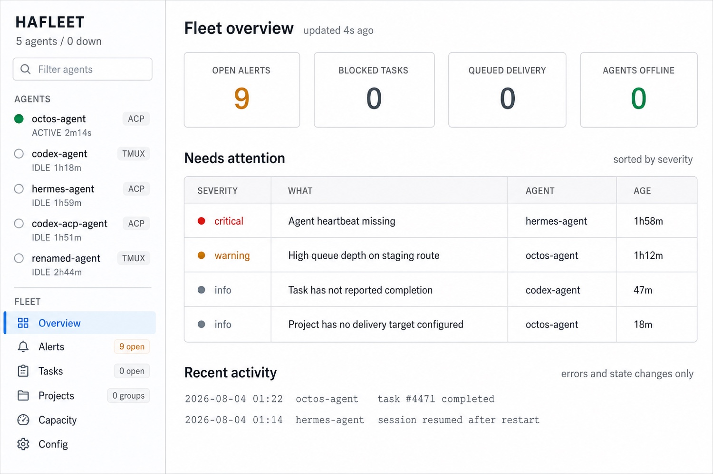
Four counters, a *Needs attention* table ranked by severity, and recent activity. This is the
page round 1 was told it was missing: the old monitor opened on `NO AGENT SELECTED` and made
you click each agent to find trouble.

### /agents/:name — Agent detail
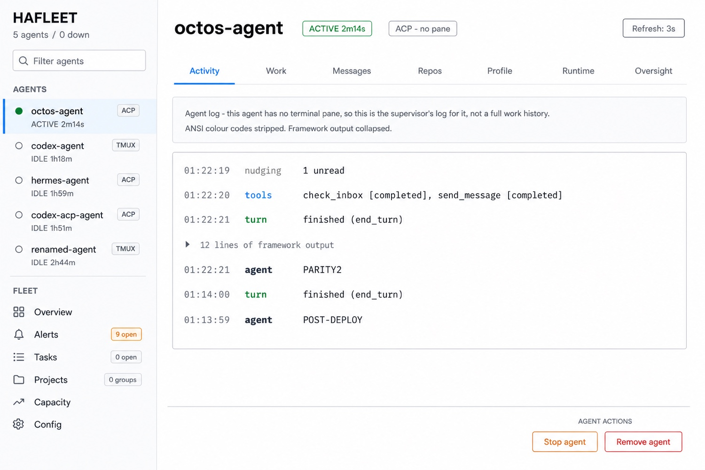
The first tab is **Activity**, not Terminal. Round 1 proposed Terminal and was wrong:
`grep -ci terminal agent-detail-page.js` returns **0**, and `octos-agent`, `hermes-agent` and
`codex-acp-agent` all have `tmux=None`, so three of five agents cannot show a pane at all. The
`ACP · no pane` pill and the inset notice state which source is being shown. **Stop/Remove are
exiled** to a separated *Agent actions* block, not placed beside the refresh controls.

#### Activity has three sources, and two of them need work

Round 2 caught that the mockup's notice — *"Showing its ACP session stream instead"* — invents a
data source. Verified: the only content endpoints are `/api/tmux/capture/:session` and the
generic dashboard SSE at `/api/stream`. `recentUpdates()` / `updatesSince()` exist **in the ACP
host process only**, and that host runs **no HTTP server**. So the round-1 error repeated itself
in new clothes: an impossible tab replaced by an impossible source.

What Activity actually resolves to:

| transport | source | status |
|---|---|---|
| tmux (`codex-agent`, `claude-agent`) | `GET /api/tmux/capture/:session` | exists today |
| ACP (`octos-agent`, `hermes-agent`, `codex-acp-agent`) | tail of `data/services-local/logs/agent:<name>.log` | file exists (189 KB for octos); needs one read-only endpoint |
| neither / not started | empty state naming why, and a link to `hafleet acp-up` | to draw |

The ACP path is a log tail, not a protocol surface. That is deliberate: the host already writes
turn boundaries, tool names and agent output to that log — the work is one bounded-range file
read, not exposing `session/update` over HTTP. Freshness, byte cap and truncation marker must be
specified before it is built.

`Refresh: 10/sec` must not render for an ACP agent: it was pane-polling for tmux. The ACP path
polls the log at a lower fixed rate, and the control says so or is absent.

### /alerts — Triage
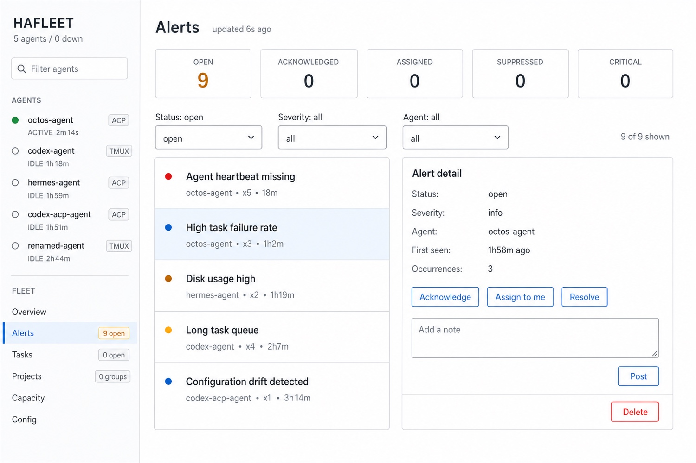
Preserves everything the current page already does well: the five-status stats strip, three
filters, severity-dotted list with occurrence counts and age, and a detail panel whose actions
are the legal transitions from the current status. Round 1 scored IA 10/100 having measured only
the monitor; this page was already good.

### /tasks — Fleet work list
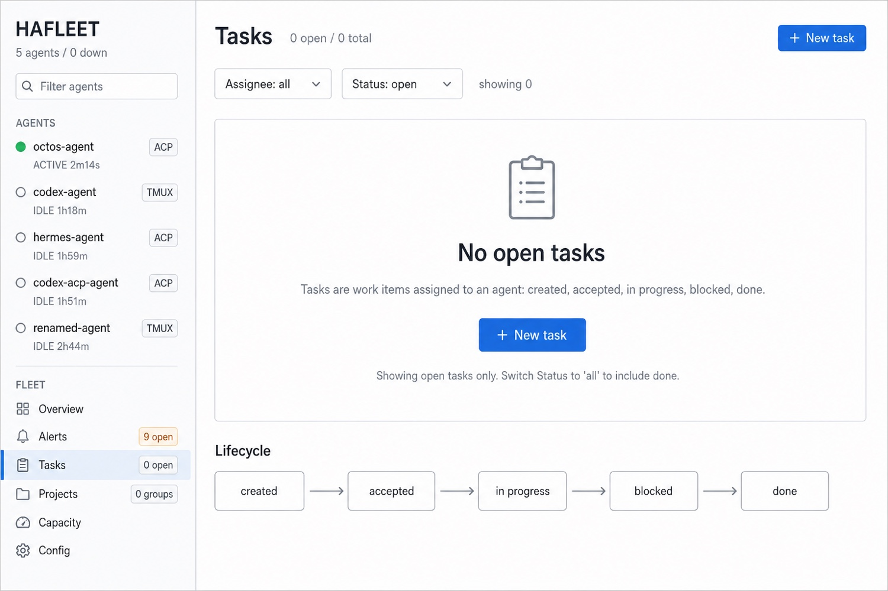
Designed for its real state: empty. The empty panel says what a task *is* and offers the one
action, and the footnote states the count's denominator — `Showing open tasks only`. The lifecycle
is a branching state machine, not the linear strip the round-2 mockup drew:

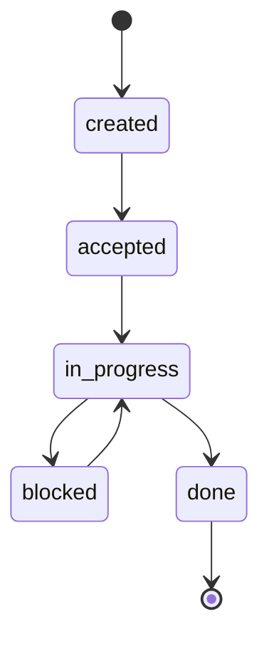

`blocked` is a detour from `in_progress` and returns to it. Drawing it as a mandatory step
before `done` — which the mockup does — misstates the model.

### /projects — Project board
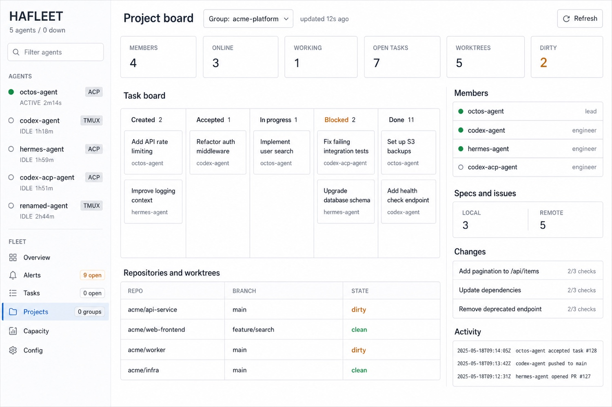
Round 1 called Projects "an attribute of an agent" and proposed folding it under one. That was
wrong: `projects-page.js` reads only `/api/project-board`. It is a fleet board — group selector,
members, five-lane task board, repos and worktrees with dirty state, local/remote specs, change
requests with check counts, activity. All of it survives.

### /pool — Capacity
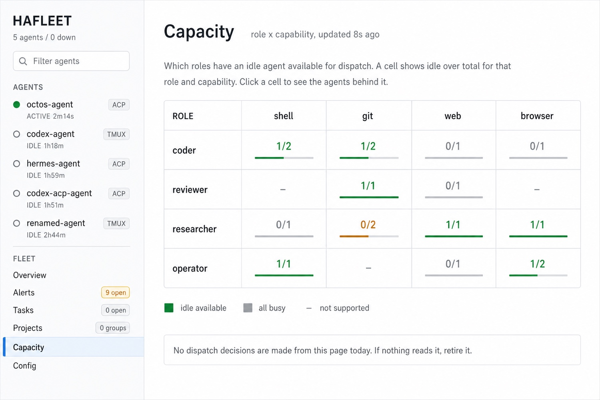
Renamed from `POOL`, which named a data structure. The `idle/total` fractions and the three-item
legend make the axes legible.

**Correction.** Two earlier drafts said this page might be retired "if nothing dispatches from
it". Wrong, and wrong for the same reason as the Terminal error: I checked the page and not the
API. `/api/pool` is consumed by `lib/matrix-agent.js` and `src/dispatch-lease-store.mjs` —
it is the state of a live scheduler.

### /config — Fleet configuration
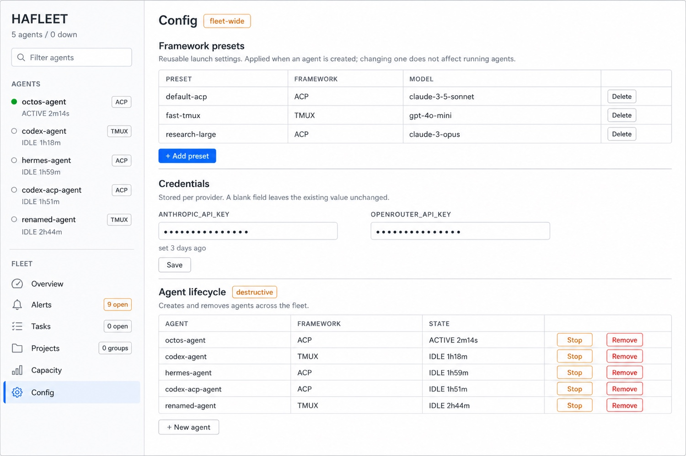
Three sections separated by blast radius: framework presets, provider readiness, then agent
lifecycle behind a `destructive` marker.

**Correction.** An earlier draft put a *Credentials* panel here, with masked inputs and
"a blank field leaves the existing value unchanged". That was wrong twice. It was
fabricated — `config-page.js` has no credentials endpoint, only `/api/agents` and
`/api/framework-presets` — and it inverted where provider auth belongs. **An agent
authenticates itself before it joins the fleet**, and HAFleet never sees the secret:

| framework | credential lives in | set by |
|---|---|---|
| hermes | `~/.hermes/` | `hermes auth add <provider>` |
| codex, codex-acp | `~/.codex/` | `codex login` |
| claude | `~/.claude/` | `claude login` |
| octos | `~/.config/octos/config.json` | its own config |

What replaces it is **read-only**: whether each agent resolved a provider, and the command
to fix it if not. That is information HAFleet legitimately has, because a missing provider
is the most common onboarding failure — hermes reported healthy and then crash-looped 35
times on one. `acp-up` already refuses to report success in that case rather than offering
to configure it.

HAFleet's own secrets — `API_TOKEN`, per-agent tokens, `MATRIX_REG_TOKEN` — are a different
kind: install-time `.env` material at mode 600, deliberately not editable from a browser. A
dashboard that can rewrite its own auth token is a dashboard that can lock everyone out of
itself. The static `page-config.jpg` above still shows the withdrawn panel; the prototype is
correct.

## Constraints taken as given

| | |
|---|---|
| Rendering | Server-side template literals returning whole HTML documents. 7 pages, 7,498 lines under `lib/dashboard/render/`. |
| Hydration | Each page inlines its own JS and CSS. No modules, no bundler. |
| Existing sharing | `browser-guards.js` exports `DASHBOARD_BROWSER_GUARDS_SCRIPT`, a template-literal string that 6 of 7 pages inline. The shell follows this exact pattern. |
| Routing | `lib/dashboard/page-routes.js`, 7 `app.get` handlers, each `res.type('html').send(renderXPage())`. |

## Typography and theme

| | |
|---|---|
| Latin | Roboto, weights 400/500 |
| CJK | Open Sans SC, weights 400/600 |
| Monospace | system stack, log and code panels only |

Fonts are self-hosted `woff2` under `public/fonts/` with `font-display:swap` and a
`unicode-range` split so CJK is fetched only when CJK is rendered. No CDN: the dashboard is
reachable on hosts with no outbound network, and a font CDN would make type a availability
dependency. Self-hosting adds asset files, not a runtime dependency, so the no-build-step
constraint holds.

Light palette: `#ffffff` page, `#f6f7f9` panels, `#e3e6ea` rules, `#1f2933` text, `#69737d`
secondary, `#1a73e8` accent, `#188038` / `#b06000` / `#c5221f` for healthy / warning / critical.
Semantic colour is never the only signal — every state also carries a word.

## Module structure

One new module. The seven page renderers keep their signatures and their bodies; each
returns its body fragment to the shell instead of a whole document.

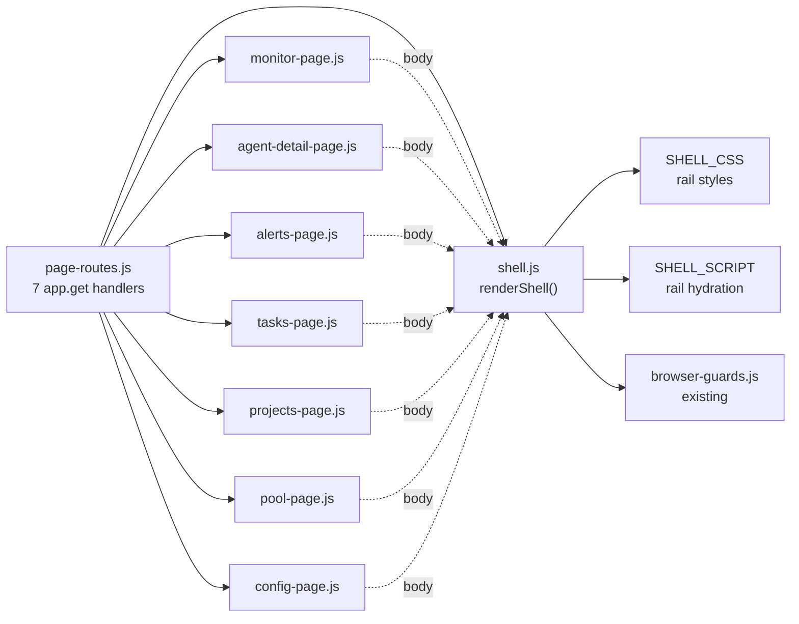

### shell.js public surface

```js
// lib/dashboard/render/shell.js
export function renderShell({
  active,      // 'overview' | 'agent' | 'alerts' | 'tasks' | 'projects' | 'capacity' | 'config'
               // Seven, matching seven registered routes. Round 1 listed 'queue', which has no
               // handler, and omitted 'pool'/'capacity', which does. A rail destination with no
               // route is a dead link the tests must catch.
  agentName,   // string | null — highlights that agent in the rail
  title,       // document title
  head,        // page's own <style> and <link> markup
  body,        // page's own markup, dropped into <main>
  script,      // page's own inline JS
}) // -> complete HTML document string

export const SHELL_CSS    // rail + grid only; no page styles
export const SHELL_SCRIPT // rail hydration only; no page logic
```

The shell owns the rail and nothing else. It never touches a page's CSS or JS, so any
page can be relaid out later without the shell changing.

## Render sequence

The rail must show live agent state on *every* page, not just the monitor. It hydrates
client-side from the endpoint the monitor already uses, so there is no new server work
and pages stay static and cacheable.

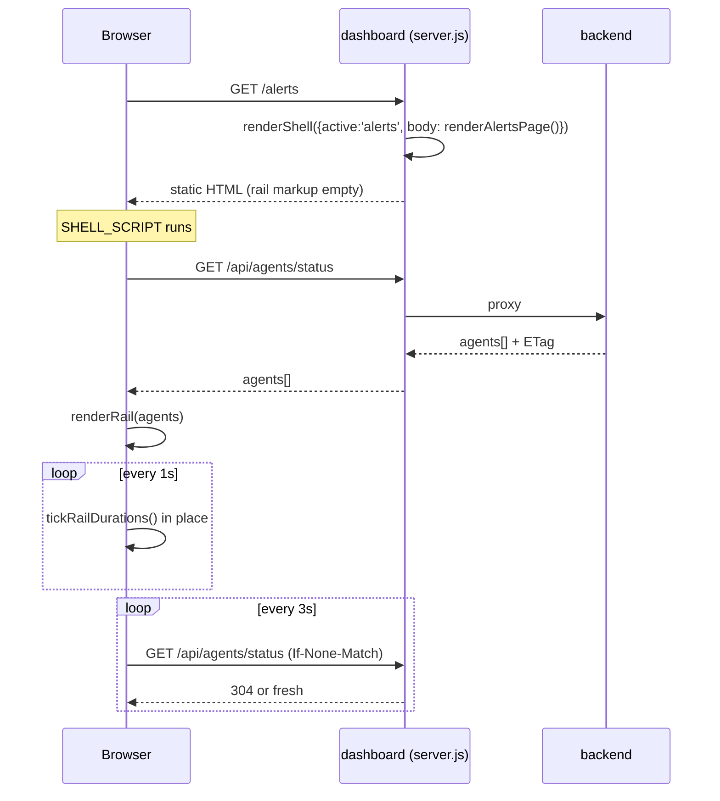

`/api/agents/status`, its ETag handling, and the duration-tick pattern already exist in
`monitor-page.js`. The rail lifts `runtimeStatusText()`, `fmtSpanSec()` and the in-place
tick into `SHELL_SCRIPT`; the monitor then uses the shared copy instead of its own.

## Rail DOM contract

```html
<div class="app">                          <!-- grid: 242px 1fr -->
  <nav class="rail" aria-label="Fleet">
    <div class="rail-brand">…</div>
    <h2 class="rail-sec">Agents</h2>       <!-- real heading; page has none today -->
    <ul id="rail-agents">
      <li><a href="/agents/NAME" aria-current="page">
        <span class="glyph">●</span>
        <span class="nm">NAME</span>
        <span class="st" data-state-for="NAME">ACTIVE 2m14s</span>
        <span class="tag">ACP</span>
      </a></li>
    </ul>
    <h2 class="rail-sec">Fleet</h2>
    <ul><li><a href="/alerts">Alerts <span class="pill hot">9</span></a></li>…</ul>
  </nav>
  <main class="main">…page body…</main>
</div>
```

| decision | why |
|---|---|
| `<a href>`, not `<button>` | Agents already have real URLs (`/agents/:name`). Links give middle-click, bookmarking and keyboard nav for free; the current buttons give none. |
| `data-state-for` | Already shipped. The tick rewrites `textContent` only, so the list never re-sorts under the pointer. |
| `aria-current="page"` | Selection is currently a CSS class with no semantics. |
| `<nav>`, `<h2>`, `<ul>` | The monitor page has zero `h1`–`h4` today. This adds structure where it is cheapest. |
| Counts always rendered | `Tasks 0` / `Projects 0` — an empty destination should be visibly empty. Both are genuinely 0. |

### Grid and collapse

```css
.app  { display:grid; grid-template-columns:242px 1fr; min-height:100vh }
.rail { position:sticky; top:0; height:100vh; overflow-y:auto }

/* Fleet nav is pinned so a long agent list cannot push it below the fold. */
.rail        { position:sticky; top:0; height:100vh; display:grid; grid-template-rows:auto auto 1fr auto }
.rail-agents { overflow-y:auto; min-height:0 }   /* only this region scrolls */
.rail-fleet  { border-top:1px solid var(--line) } /* always visible */

/* At 900px keep the STATUS, drop the tag. Round 1 hid .st and then claimed
   "fleet state survives" — it did not; only indistinguishable dots survived. */
@media (max-width:900px){
  .app{ grid-template-columns:150px 1fr }
  .rail .tag{ display:none }
  .rail .nm{ overflow:hidden; text-overflow:ellipsis; white-space:nowrap }
}
@media (max-width:640px){ .app{ grid-template-columns:1fr } .rail{ position:static; height:auto } }
```

At 900px the rail narrows to 150px and drops the transport tag, keeping the name (truncated) and
the status text — the two things the rail exists for. Below 640px it stacks.

## State

No new state. Selection already lives in the URL; the rail derives its highlight from
`location.pathname`. Tabs already sync to `location.hash` via
`setActiveTab(..., {updateHash})`.

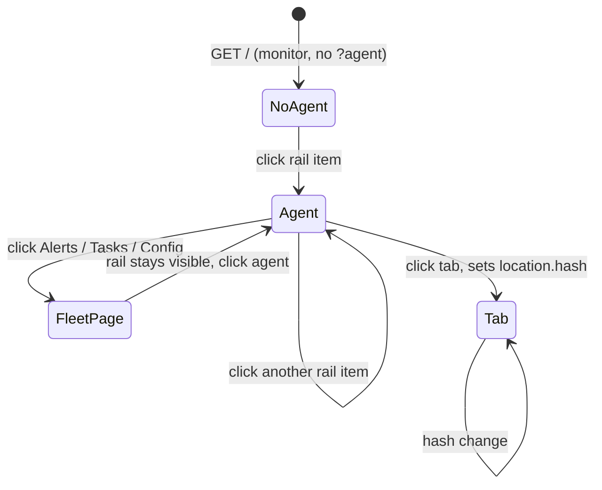

The rail is present on every route, so agent state never leaves the screen.

## Dissolving Internals

One tab holds 140,230 of the page's 169,000 characters — 83% — under a name no operator
is looking for. It also contains **Managed Projects** (the whole Projects concept for an
agent) and a duplicate **Supervisor Audit**.

**Measured, and it changes the risk.** The Internals panel contains 43 element IDs; 31
are bound via `getElementById`, and **0 references depend on the `tab-internals`
ancestor**. Handlers bind by ID, not DOM position — so this is re-parenting `<section>`
nodes, not rewriting 140 KB. Mechanical, not risky.

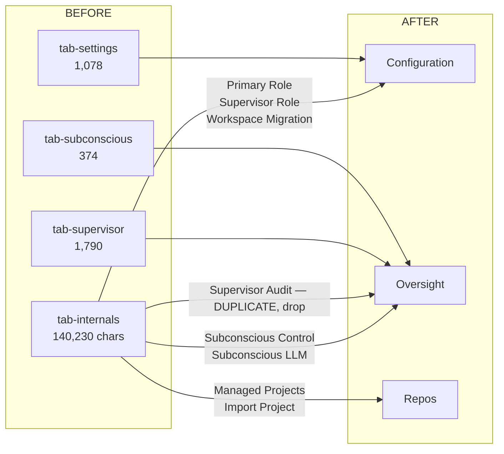

| panel today | in tab | moves to |
|---|---|---|
| Identity, Guidance, Ownership | settings | **Profile** |
| Configuration (effective runtime), Framework Presets | settings | **Runtime** |
| Primary Role, Supervisor Role, Workspace Migration | internals | **Runtime** |
| Create Task, Task Detail | tasks | **Work** |
| Direct Messages | dm | **Messages** |
| Managed Projects, Import Project | internals | **Repos** (new) |
| Docs Snapshot, Signal, Audit, Audit History | supervisor | **Oversight** |
| Subconscious Control, Subconscious LLM | internals | **Runtime** — they are controls |
| Subconscious (status only) | subconscious | **Oversight**, renamed Guidance path status, read-only |
| Supervisor Audit (2nd copy) | internals | **deleted** — keep the supervisor-tab one |
| System Controls (Stop / Remove) | settings | **separated *Agent actions* block**, below the panel |

Tab count goes six to **seven**: `Configuration` was doing two unrelated jobs and splits into
`Profile` and `Runtime` — see the content map above. Every name is now something an operator
would look for, and no tab is a stub. `Activity` becomes the default instead of `Settings`.
Round 2 presented six balanced tabs as a virtue; it was a size test, not a task model.

## Agent tabs — content map

Both reviewers called `Oversight` and `Configuration` junk drawers in every round, and they were
right: the round-2 tab set was six balanced *sizes*, not six coherent tasks. Specified by codex,
adopted as written. It is **seven** tabs, because `Configuration` was doing two unrelated jobs.

Final set: **Activity · Work · Messages · Repos · Profile · Runtime · Oversight**

The governing rule: *Oversight is read-only. Controls must not sit beside the evidence used to
judge them.*

### Profile — who is this agent, who owns it, what intent should it follow

Identity, then Guidance, then Ownership. One `Save profile` boundary across all three, with dirty
and last-saved state. Framework, model, roles, automated controls, audit evidence, migration and
presets do **not** belong here.

### Runtime — how is it launched, and which automated systems shape it

1. Effective runtime — framework, transport, server, model, reasoning, workspace. Effective values first.
2. Framework preset — the applied preset and its resolved values; global preset CRUD links to fleet Config.
3. Roles — Primary, then Supervisor; show desired vs effective when they differ.
4. Supervisor control — enable, cadence, policy. Controls only.
5. Subconscious control — desired state, authoritative vs fallback mode.
6. Subconscious LLM — provider, model, endpoint, key-env *reference* and resolution status. Never the secret.
7. Workspace migration — last, collapsed, marked disruptive, with preview, confirmation and outcome.

Saves are per subsystem: runtime/preset/roles, Supervisor, Subconscious/LLM. Migration is an
action, never a save field. Signals, audit, Stop/Remove and global presets do not belong here.

### Oversight — does this agent need intervention, and what did oversight already do

1. Current assessment — Supervisor Signal, severity, reason, lifecycle, evaluated-at, freshness, recommended action. Disabled or stale state comes *before* history.
2. Current work evidence — Supervisor Docs Snapshot, with an explicit warning that it is not the canonical Task.
3. Guidance path status — renamed from `Subconscious`. Read-only: active path, stage, last invocation, degraded pieces. "Configure" links to Runtime; no toggles here.
4. Recent supervisor decisions — Supervisor Audit, newest first.
5. Audit history — filterable full history.

Supervisor Audit and Audit History are **two views of one canonical event collection**, not the
duplicate the round-1 measurement found. Raw dumps go in a collapsed Diagnostics drawer under
Runtime, or are dropped.

## The ACP activity-log endpoint

Activity needs this for the three ACP agents. Contract specified by codex; the security properties
are the point.

```
GET /api/agents/:name/activity-log?limit=200&cursor=OPAQUE
```

**Name to path, safely.** Decode once; reject NUL, slashes, dot segments, controls, or anything
outside `^[A-Za-z0-9][A-Za-z0-9_-]{0,127}$`. Resolve against the registered-agent inventory —
unknown is 404, and no path is ever constructed for an unregistered name. Build exactly
`agent:<CANONICAL>.log` under the configured absolute log root. Open only a regular non-symlink,
`O_NOFOLLOW` where available, and re-verify `realpath(file)` is still under `realpath(root)` after
open. **No path, filename or raw offset is ever a request parameter, and the host path never
appears in a response.**

**Cursor, rotation, truncation.** The cursor is server-issued authenticated state — version,
device, inode, next offset, prior size — expiring in 24h, so a client cannot author an offset. Same
inode with `size >= offset` appends; `size < offset` returns `resetReason: truncated`; a changed
device or inode returns `resetReason: rotated`. Both cases mean the UI replaces rather than appends,
and says so. Partial trailing lines are withheld until complete. Order is oldest-to-newest. An
invalid cursor is `400 invalid_cursor`, never a guessed read.

**Sanitising, before budgeting.** UTF-8 with replacement; strip ANSI and OSC escapes and C0
controls except tab and newline — the real log is saturated with them. Cap 8 KiB per line and mark
clipped; 128 KiB response budget; report `truncated` at either cap. Redact values whose key matches
`api_key`, `apikey`, `token`, `secret`, `password`, `credential`, `authorization` or `cookie`.

**Labelling.** The UI says *"Agent log"* and states it is the supervisor's log for this agent, not
a complete work history. A missing log for a known agent is `200` with `state: empty` and
`reason: log_not_found`, not an error.

## Alerts summary strip

Round 2: the strip mixed four lifecycle statuses with one severity metric, and omitted `resolved`.
Two strips, one dimension each:

- **Status** — `open`, `acknowledged`, `assigned`, `suppressed`, `resolved`
- **Severity**, of the open set only — `critical`, `warning`, `info`

The rail pill counts **open** and says so (`9 open`), matching the first cell of the status strip.
A pill that disagrees with the strip the operator reads on arrival is worse than no pill.

## Populated Tasks

Round 3: a task system cannot be judged from an empty state. Specified by codex.

**Header** `Tasks — N open / M total`. Filters: Assignee, Status (default Open), Priority, text
search. *Open* means every status except `done`.

**Columns** status word badge · priority `P0`–`P3` · title with short ID and parent beneath ·
assignee or `Unassigned` · waiting/heartbeat (blocked shows reason and until or `OVERDUE`;
in-progress shows heartbeat age or `STALE`; otherwise em dash) · updated, relative with an exact
accessible timestamp.

**Ordering, blocked first:** bucket `blocked → in_progress → accepted → created`, then priority
`P0→P3`; blocked ties break on overdue, then earliest `waiting_until`, then oldest `updated_at`.
`done` orders by `completed_at` descending. `BLOCKED` and `OVERDUE` appear as words, not colour.

**Detail** master/detail wide, full-width with Back when narrow. Row click sets `?task=ID`. Renders
only *legal* transitions — Accept, Start work, Mark blocked, Resume, Mark done — with blocking
collecting its required waiting metadata. Actions stay in-flight until confirmed; failure keeps the
prior state. Delete is separated, confirms ID and title, and is never optimistic. Comment drafts
survive refresh.

**Shared contract, so Tasks and Work cannot drift.** Both consume one `TaskDTO` matching
`task-store` exactly — `id, title, description, status, priority, granularity, assignee,
created_by, created_at, updated_at, started_at, completed_at, heartbeat_at, waiting_reason,
waiting_until, parent_id, labels, health, comments` — through one shared renderer. Agent *Work* is
the same view with a locked `assignee=<agent>` scope plus "View all fleet tasks"; it is not a fork.
One definition owns status labels, the Open predicate, priorities, legal transitions, the stale
threshold, sorting, time formatting, URL selection, in-flight state and draft preservation. Contract
tests render one DTO through both scopes and assert identical output.

This also settles the naming complaint from round 2: `Work` is a *scope* of Tasks, not a third name
for the same objects.

## States every page must draw

Round 2's standing objection: only happy paths are drawn. Each page owes four states.

| page | loading | empty | error | in-flight action |
|---|---|---|---|---|
| Overview | counters skeleton, table placeholder rows | "Nothing needs attention" with last-checked time | per-card failure, other cards still render | n/a, read-only |
| Agent detail | tab frame with panel skeletons | Activity: no pane and no log; Work/Repos: scoped empties | source named in the failure: pane vs log vs backend | button disabled + spinner, outcome notice |
| Alerts | stats strip skeleton, 3 list placeholders | "No alerts match these filters" + a reset link | keep last good list, banner above it | transition button busy, row stays until confirmed |
| Tasks | table skeleton | drawn — states its denominator | banner, filters remain usable | create/edit/comment each own their button |
| Projects | per-section skeletons, independent | "No project groups" + how to create one | per-section failure; one dead section must not blank the board | Refresh busy state |
| Capacity | grid skeleton | "No agents report capabilities" | banner | leases and tickets refresh; releasing a lease is an action and reports its outcome |
| Config | section skeletons | presets empty, credentials unset | per-section, never a whole-page white screen | Save busy; blank-means-unchanged restated |

Two rules across all seven: a failed refresh keeps the last good data and says it is stale, and
no destructive action is optimistic.

## Accessibility contract

Round 2 called `role="tab"` alone fake accessibility. It is. The tab set owes all of:

- `role="tablist"` on the container, `role="tab"` + `aria-selected` + `aria-controls` per tab,
  `role="tabpanel"` + `aria-labelledby` per panel
- roving `tabindex`: selected tab `0`, others `-1`; Left/Right/Home/End move selection
- selection mirrored to `location.hash`, Back returns to the previous tab, focus follows
- rail: `<nav aria-label="Fleet">`, `aria-current="page"` on the active destination,
  `<a href>` so middle-click and bookmarking work
- every state carries a word, never colour alone — this is the rule the round-2 Overview mockup
  broke, showing a red dot labelled `info`
- action outcomes announced through one `role="status" aria-live="polite"` region
- visible focus ring on every interactive element; no `outline:none` without a replacement

## Benchmark, replacing the score

Round 2 was right that 34/100 is theatre — no weights, no anchors, no protocol. Replace it with
timed tasks against a seeded fleet, three operators, median of three runs:

| # | task | today | target |
|---|---|---|---|
| 1 | Name every agent that is active, and for how long | click each agent | ≤ 10s, no clicks |
| 2 | Find the oldest unresolved alert and say which agent it is on | 2 clicks + scan | ≤ 15s |
| 3 | Find the one blocked task and its assignee | unclear where | ≤ 15s |
| 4 | Say whether any repository has uncommitted work | not discoverable | ≤ 20s |
| 5 | Stop an agent, and be sure it stopped | 2 paths, no confirmation of outcome | ≤ 20s, outcome stated |
| 6 | Say what a queued message is waiting for | queue card, unlabelled | ≤ 15s |

A design change is justified when it moves a number here. Nothing else is a score.

## What happens to the monitor

Round 2's remaining structural objection. `monitor-page.js` is 1,950 lines and owns five live
surfaces that the Overview does not replace. Each needs a destination before `/` changes:

| surface | today | goes to |
|---|---|---|
| terminal pane + speed/pause/bottom | `#terminal-wrap` | agent detail, Activity tab, tmux source |
| pending queue, hover lock, tombstones | `#queue-panel` | Overview *Queued delivery* card links to a queue view; the concurrency machinery moves unchanged |
| reminders | `#reminder-panel` | Overview *Needs attention*, reminder rows |
| message log | `#msglog` | agent detail, Messages tab |
| new-agent modal | monitor modal | Config, *Agent lifecycle* |
| Stop/Remove (second copy) | `#agent-info` | deleted; agent detail's block is the only one |
| the monitor page itself | `/` | stays exactly as it is until the seven rows above ship, then `/` serves Overview and `monitor-page.js` is deleted |

Until that table is implemented, `/` keeps rendering the monitor and Overview lives at
`/overview`. The rail links `/overview` from day one, so no route changes twice.

## The prototype

A running Next.js app implements this design: [`mockup/`](../../mockup/), on port 3100.

```bash
cd mockup && npm install && npm run dev
```

It exists because three findings could not be answered by a drawing:

- **Populated Tasks.** An empty state cannot demonstrate blocked-first ordering, waiting
  and heartbeat density, or a detail panel offering only the legal transitions.
- **The corrected Alerts strips.** The static mockup kept showing the rejected version
  that mixed four lifecycle statuses with one severity metric.
- **The Queue destination.** Promised by the migration table, never designed.

It also makes the invariants executable — `npm run check` asserts them against the served
HTML rather than trusting the prose:

| assertion | catches |
|---|---|
| every rail destination returns 200, an unregistered one 404s | a dead link like round 1's `queue` |
| the rail renders on all 12 routes, marking exactly one destination | a page forgetting the shell |
| `role="tablist"`, seven tabs, one `aria-selected`, `aria-controls` on each | the half-applied ARIA round 2 called fake |
| every severity dot has a word beside it | the red dot labelled `info` |
| needs-attention ranked most-severe-first | the page that claimed to rank and sorted by age |
| task list ordered blocked-first | ordering asserted in prose only |
| a status class is not reused as a warning | found by this check: `.badge.blocked` was doing duty as both a task status and a stale-heartbeat warning, so no assertion could tell them apart |
| an ACP agent is offered no `10/sec`, and says it has no pane | pane polling for agents with no pane |
| rail counts carry their unit | found by this check: React splits adjacent JSX expressions with a comment marker in SSR, so `{n} {unit}` rendered as `4<!-- --> open` and fragmented the text node |

The last two rows are the argument for building it. Both are real defects that a picture
cannot contain and prose did not catch.

### Renders

`docs/design/shots/` holds screenshots taken from the running prototype, so they cannot
drift from it the way a hand-drawn mockup does — regenerate them by driving the page,
not by editing an image. Two locales × two themes are covered:

| file | shows |
|---|---|
| `overview-en-light.png` | the triage surface, English, light |
| `overview-zh-dark.png` | the same page, Chinese, dark — the comparison that matters |
| `alerts-zh-light.png` | two summary strips and list/detail in Chinese |
| `tasks-zh-dark.png` | populated blocked-first list |
| `capacity-en-light.png` | role × capability with leases |
| `agent-en-dark.png` | agent detail, Activity tab, dark |
| `onboard-en-light.png` | detection table and the form with a model field |
| `onboard-zh-dark.png` | the same form for an adapter that takes **no** model flag |

## Capacity, corrected a third time

This page was wrong three times, and each time the error was the same shape: I read the
renderer and the API signature instead of running the scheduler against real data.

1. **"Retire it if nothing reads `/api/pool`."** Wrong — `lib/matrix-agent.js` and
   `src/dispatch-lease-store.mjs` both read it. Withdrawn earlier.
2. **Invented axes.** The fixture had `shell/git/web/browser` × `coder/reviewer/
   researcher/operator`. Neither list exists anywhere in the scheduler.
3. **Invented populated data**, which is worse than either. On this fleet the grid is
   empty, and drawing a busy-looking scheduler for a feature that has never been
   connected is the one failure mode a mockup must not have — an implementer would
   conclude that wiring up the API produces rows.

### The real model

`lib/matrix-agent.js` declares six organisational **roles** as columns and three
**ordered capability tiers** as rows, which is also how `pool-page.js` orients them:

| | architect | coding | testing | review | integration | documentation |
|---|---|---|---|---|---|---|
| `strong` — claude opus | | | | | | |
| `medium` — claude sonnet | | | | | | |
| `lightweight` — claude haiku | | | | | | |

Each role has a default tier (`ROLE_DEFAULT_TIER`): `architect` and `review` at
`strong`, `coding`/`testing`/`integration` at `medium`, `documentation` at
`lightweight`. A cell holds the actual agent records with their busy state, not a count.

`POST /api/dispatch {role, capability}` → `resolveTier()` (explicit wins, else the role
default) → `selectAgent()`, which filters to the same role, online and idle, keeps
anything at a tier no weaker than requested, and sorts cheapest-sufficient-first so a
`strong` agent is not spent on `lightweight` work. A hit returns `routed` plus a
15-minute renewable lease; a miss returns `provision` when `MATRIX_AGENT_MAX_PER_CELL`
is above zero and the cell is under cap, otherwise `queued` with a per-cell ticket.

**Substitution is real but bounded.** A stronger idle agent covers a weaker request, so
an empty `lightweight` cell does not mean undispatchable. It never crosses a role —
`selectAgent()` matches `agentRole(a) === role` before it looks at the tier. The old
`idle/total` cell could not express either half of that, and its legend ("`–` not
supported") actively taught the opposite.

### What is actually true of this fleet

Measured, not assumed, by running the real module against the real agent names:

```
octos-agent  codex-agent  hermes-agent  codex-acp-agent  claude-agent
  -> role=null for all five
  -> indexPool() grid: {}     total: 0
```

`canonicalRole()` infers a role from substrings in the agent name — `architect`,
`review`, `test`, `integrat`, `doc`, `coder` — and none of these names match one.
`agentRole()` returns `null` and `indexPool()` skips the record outright.

**One name differs from the transcript.** The live fleet's fifth agent is called
`renamed-agent` — visible in [dashboard-ux-review.md](dashboard-ux-review.md)'s success-test
capture, which is a record of what was on screen and is left alone. Nothing in the codebase
implements an agent rename (the sole mention is a comment at `backend-v2.js:5161` noting a
rename would have to move the runtime twin in `agent_runtime.json`), and `data/acp-agents/`
holds `a-different-name.log`, `already-supervised.log` and `probe-agent.log` — so the name is
almost certainly a probe artifact that outlived its test, and it breaks the fleet's own
`<framework>-agent` convention.

The prototype fixture therefore calls it **`claude-agent`**, which is what the convention
implies and what makes the roster legible. `canonicalRole('claude-agent')` still returns
`null`, so the measurement above is unchanged. Noted rather than silently corrected, because
the fixture is now a tidied version of the fleet rather than a transcript of it — and the two
should be reconciled by fixing the fleet, not by editing the capture.

The consequence is not cosmetic. A dispatch for each of the six roles:

```
architect / coding / testing / review / integration / documentation
  -> selectAgent = null,  plan = provision  (all six)
```

With `MATRIX_AGENT_MAX_PER_CELL` at its default of `0` there is no provisioning either,
so **every `POST /api/dispatch` on this fleet queues, and nothing will ever staff the
cell.** The page is not broken; it was never connected.

`POST /api/agents` already destructures `role` and `capability`. No onboarding path
sends either — not `hafleet acp-up`, not `register-agents`, not the ACP host. That gap is
the whole explanation.

One asymmetry to know before building the fix: `PATCH /api/agents/:name` destructures
`role` but **not** `capability`. An existing agent can be given a role and lands on that
role's default tier; a non-default tier can only be set at registration, which no CLI
path exposes. `/onboard` shows the `PATCH` as a second command and says so, rather than
printing an `acp-up` line that silently cannot carry the field.

**The printed command has to run.** The first version of it — `curl -X PATCH
.../api/agents/<name> -d '{"role":"coding"}'` — could not, in three ways, and the page's
whole argument for printing a command is that seeing it is how you notice the form built
the wrong one. `...` is not a host, so it uses `http://127.0.0.1:8090`, the documented
`HAFLEET_API` default. **`-H 'Content-Type: application/json'` is load-bearing**: the
global `express.json()` parses nothing without it, so `role` arrives `undefined`, and the
handler's `if (role !== undefined)` guard turns the request into a 200 that changed
nothing — a silent no-op on the one command that fixes the empty grid. Auth stays a note
rather than a printed flag, because it is conditional: the `/api` gate exempts local
requests, and the per-agent `X-Agent-Token` check only bites when that agent has a token
and `HAFLEET_AGENT_TOKEN_MODE` is not `audit`. A printed header that the local case does
not need is its own small lie.

### How the page handles it

It opens on the truth — empty grid, with the reason, the dispatch consequence, and the
fix — and offers the populated layout as an explicitly labelled second view of the same
five agents. Leases and tickets belong to the view, not beside it: a lease exists only
because `selectAgent()` returned an agent, so an empty grid above a populated lease table
is the page contradicting itself.

Three things about that second view were wrong in the first build of it, and all three
came from treating the view as component state rather than as a selection:

- **The label has to travel with the view.** A pressed segment button in the header is a
  screen and a half above the lease table, and a lease table with rows in it is exactly
  what makes an implementer conclude that wiring up the API produces data. The
  hypothetical notice now sits in the body, above the grid.
- **The view lives in the URL** — `/capacity?view=assigned`, read on mount and on
  `popstate`, written with `pushState`. Selection round-tripping through the URL is
  already an invariant here; holding this one in `useState` also meant it was not
  linkable, was lost on reload, and — the part that mattered — **no URL-driven check
  could reach it**, so the responsive sweep was measuring the empty view twice and the
  populated grid, which is the wide one, was never tested at all. Plain `history` rather
  than `useSearchParams()`, so the server render stays the honest default view and
  `/capacity` keeps prerendering statically.
- **Emptiness is a property of the cells, never of `total`.** `GET /api/pool` answers
  `total: records.length` — every pool record, including the ones `indexPool()` skipped —
  which on this fleet is **5 while the grid is `{}`**. The fixture had `total: 0` and the
  page gated its empty state on it, so wiring the page to the real endpoint would have
  produced a blank grid with none of the explanation, on precisely the fleet the page was
  written for. `gridTotal()` reads the cells.

**And no cell states itself in a mark alone.** The empty cells rendered `—` or a green
`↑` with the meaning only in `title` — mark plus colour, word in a tooltip, invisible to
touch and unreliable on a `<td>`. That is the rule the severity component exists to
enforce, and the assertion covering it only inspected severity dots, so the newest page
walked past both. Cells now read `— queues` and `↑ strong`, and naming the covering tier
says more than the arrow did. The legend keys those two states with the marks themselves
rather than a colour swatch standing in for text.

### Assertions

The axes are not checked against a copy of themselves. `check-invariants.mjs` reads
`../lib/matrix-agent.js`, extracts `ROLES` and `CAPABILITY_TIERS`, and compares — so
renaming a role upstream fails the check, and inventing one in the fixture fails it too.
On top of that: every role has a valid default tier, every lease and ticket names a real
cell, the leased set equals the busy set in both views (mutation-tested), substitution
covers a weaker request, substitution does not cross a role, a busy agent is not
available, and the empty view has no leases but does show queued tickets.

The four corrections above are asserted rather than remembered:

| assertion | guards |
|---|---|
| **every `<td>` on `/capacity` contains a word** | the general property, not the two specific marks — a mark-only cell in any column fails it. This is the check the severity-dot assertion should always have been |
| emptiness is derived from `gridTotal()`, and the empty view still reports `total > 0` | the `/api/pool` semantics above. Both halves are needed: the fixture must keep lying in the *same* way the endpoint does |
| `routable()` and `coveringTier()` agree on every cell of the grid | two implementations of one rule drifting, now that the cell needs the tier and not just a boolean |
| the printed `PATCH` names a real host, sends a JSON content type, and still carries the role | the silent no-op above |
| `?view=assigned` selects the populated grid, the pressed segment agrees with the URL, a reload keeps it, Back returns to the default | the view leaving the URL again |
| the populated view says on screen that it is hypothetical | the label drifting back into the header alone |
| no cell in the *populated* view is a mark alone | the half the static pass cannot see, since the server render is always the default view |
| `/capacity?view=assigned` is in the 375/640/900/1440 sweep | the wide view going untested, which it was |

Two notes on writing those, both of which cost more than the fixes:

- **`.agent-chip` was the wrong signal.** The empty view lists the five unassigned agents
  as chips too, so a bare chip count is 5 in *both* views and reads as "the view never
  changes" while the view is changing correctly. Only a chip in a cell carries
  `idle`/`busy`; the assertions count those.
- **`networkidle0` is not hydration.** A click that lands before React attaches its
  handlers does nothing, silently, and every assertion after it reads the pre-click state.
  Against `npm start` the bundle was fast enough to hide this; against `npm run dev` the
  language switch failed on every run. `check-switches.mjs` now waits for React's props
  object to appear before it clicks anything — which also means the "every button has a
  handler" pass can no longer report a whole page of dead buttons because it asked early.

## Known gaps in the drawings

Stated because a mockup that contradicts the spec is worse than no mockup — an implementer follows
the picture. From the final review round:

| gap | where | status |
|---|---|---|
| Alerts mockup still shows the rejected mixed strip (four statuses + `Critical`), omits `resolved`, and highlights one row while the detail panel shows another | `page-alerts.jpg` | spec is correct above; drawing is stale |
| Projects mockup reads `0 groups` in the rail while `acme-platform` is selected | `page-projects.jpg` | contradiction, drawing is stale |
| Populated Tasks — blocked-first list, waiting/heartbeat density, master/detail, legal-transition actions | `mockup/components/TaskList.jsx` | **closed** — built and asserted, shared verbatim by fleet Tasks and the agent Work tab |
| The Queue destination the migration table promises | `mockup/app/queue/page.jsx` | **closed** — route, layout, empty state, optimistic send with a visible restore-on-failure |
| Reminder cancel/dismiss semantics | `mockup/app/queue/page.jsx` | **closed** — discarding a reminder stops it firing and does not reschedule it; stated on the page |
| Whether the global message log narrows in scope when it moves to per-agent Messages | not specified | open |
| Responsive behaviour at 375 / 640 / 900 / 1440 px | asserted in `check-switches.mjs` | **closed** — found one real defect: `/projects` overflowed 28px at 375px because an inline `grid-template-columns` beat the collapse media query. Column ratios are modifier classes now |
| Responsive behaviour at real fleet sizes (1 / 20 / 100 agents) | fixture has 5 | open — needs fixture variants, not a layout change |
| The benchmark's *today* column | estimated | must be measured once before it means anything |
| `page-config.jpg` still shows the withdrawn *Credentials* panel | `page-config.jpg` | the prototype is correct; the drawing is stale |
| `page-capacity.jpg` still shows the withdrawn "retire it" notice and no leases | `page-capacity.jpg` | the prototype is correct; the drawing is stale |
| Nothing populates the dispatch pool: no onboarding path sends `role`/`capability`, so the grid is empty and every dispatch queues forever | `bin/hafleet-acp-up`, `bin/register-agents`, `scripts/hafleet-acp-agent.mjs` | open — the real fix is upstream of the dashboard. `/onboard` offers the fields and shows the `PATCH`, which is as far as a page can go |
| `PATCH /api/agents/:name` accepts `role` but not `capability` | `backend-v2.js` | open — an existing agent can only reach its role's default tier |
| The dispatch queue and the message queue share the word "queue" | naming | open — needs one renamed before either page ships. Both pages currently point at each other and say so |
| Three buttons shipped with no handler — projects Refresh, the agent cadence button, Pause display | header controls | **closed** — all three do something, and `check-switches.mjs` now fails on any button React gave no `onClick`. A dead control teaches the operator to distrust the live ones |
| The four page mockups predate the corrections above | `page-alerts.jpg`, `page-projects.jpg`, `page-config.jpg`, `page-capacity.jpg` | open — the clickable prototype supersedes them and `shots/` holds accurate renders; the JPEGs should be deleted rather than left to mislead |

## Change plan

| # | change | files | risk |
|---:|---|---|---|
| 1 | Add `shell.js`; wrap all 7 routes | +1 new, `page-routes.js`, 7 renderers | low — additive, page bodies untouched |
| 2 | Move rail helpers out of `monitor-page.js` into `SHELL_SCRIPT` | `monitor-page.js`, `shell.js` | low — same functions, one home |
| 3 | Rename tabs; default to **Activity**; full tablist ARIA | `agent-detail-page.js` | **moderate** — Activity needs the step-7 endpoint for ACP agents, so it is not a label change |
| 4 | Re-parent Internals sections; delete the duplicate audit | `agent-detail-page.js` | moderate — mechanical, but do it alone |
| 5 | Rename `POOL` to `Capacity`; explain the axes; surface active leases and waiting tickets | `pool-page.js`, shell | moderate — it is a scheduler view, not a static grid |
| 6 | Keep `/projects` as the fleet board; add a per-agent Repos lens that links to it | `projects-page.js`, shell | moderate |
| 7 | Add the bounded ACP log-read endpoint that Activity needs | `server.js`, new route | moderate — new surface |

Steps 1–3 ship together as one reviewable change. Step 4 is its own PR. Steps 5–6 need a
product decision, and neither earlier answer was right. `pool-page.js` states its own purpose in
lines 3-4 — *"the live role x capability grid — who's idle/busy per cell"* — so round 1's claim
that the purpose was not evident from the file was wrong; it had read only the label.

Round 2 then framed it as "retire it if nothing dispatches from this view". Also wrong.
Something does. `lib/matrix-agent.js` opens: *"agent pooling + capability scheduling + the role
matrix... The execution layer is driven by OpenFab: OpenFab asks for 'a `<role>` agent at
`<capability>`', and the scheduler picks/queues one."*

`POST /api/dispatch` resolves a `{role, capability}` request three ways:

| outcome | when | what comes back |
|---|---|---|
| `routed` | `selectAgent()` finds a free agent in the cell | a **lease** marking it busy — `HAFLEET_DISPATCH_LEASE_TTL_MS`, default 15 min, floor 1s |
| `provision` | no free agent, `MATRIX_AGENT_MAX_PER_CELL > 0`, cell under cap | a plan (`mx_<role>_<tier>_<n>`) for the launcher to run `up-v1`. Default 0 = off |
| queued | otherwise | a ticket on that cell's dispatch queue |

`GET /api/pool` reaps expired leases before answering, and an expired lease raises the
`dispatch_lease_expired` alert. So the grid, the leases and Alerts are **one mechanism**, and
this page is the human window onto it. It should show active leases and waiting tickets, not
just idle counts — the prototype now does.

The only thing wrong with the old page was its name: `POOL` named the data structure rather
than the question.

**A collision worth fixing separately.** That per-cell *dispatch* queue is not `/api/queue`,
which holds messages waiting for an agent to go idle. Two different queues share one word, in
the same way `TASK_STATUSES` and `AGENT_TASK_STATUSES` share "task".

## Invariants

Must still hold after every step:

- **Dirty-form preservation during periodic refresh** (`agent-detail-page.js`, `hasUnsavedDetailChanges()` -> `shouldPreserveDetailSettings()` -> `if (!shouldPreserveDirty) renderSettings(...)`).
  The detail page refreshes on a timer and skips the Settings re-render while edits are
  unsaved. A re-render that ignores this destroys whatever the operator is typing. Step 4
  moves DOM nodes, so this is the assertion to write first.
- **Selection round-trips through the URL** — `/agents/:name` and `?agent=` keep working;
  rail links are the same URLs.
- **Terminal poll machinery** — ETag reuse, request sequencing, visibility-aware rates,
  auto-scroll preservation, explicit Bottom.
- **Queue concurrency defenses** — hover locking, pending-action guards, tombstones,
  restore-on-failure. The outcome notice sits on top of these, not instead of them.
- **Stop vs Remove** stay separate, keep their confirmations and irreversible wording.
- **The 31 `getElementById` bindings** inside moved sections must still resolve; one
  duplicate ID would break silently.

## Tests

| assertion | guards |
|---|---|
| Every route's HTML contains `class="rail"` and `id="rail-agents"` | a page forgetting the shell |
| Rail markup is identical across all 7 pages **apart from which destination carries `aria-current="page"`** | the shell drifting per page. Round 1 asked for byte-identical, which this design makes impossible: the rail marks the current page, so the markup must differ by exactly one attribute |
| Every rail destination resolves to a route registered in `page-routes.js` | a dead link like round 1's `queue`, which had no handler |
| Every rail destination with a count renders it, including `0` | silent empty destinations returning |
| No element ID appears twice in the detail page | the re-parenting collision in step 4 |
| Every ID referenced by `getElementById` exists in the rendered output **or appears in a declared client-created allow-list** | a section moved out from under its handler. The bare form cannot pass: `#rail-agents` is filled by hydration and `#action-notice` is created at runtime, so both are legitimately absent from the static HTML |
| The tab set renders `role="tablist"`, and every tab has `aria-controls` pointing at a panel that exists | half-applied ARIA, which round 2 called fake accessibility |
| Exactly one tab carries `aria-selected="true"` | two selected tabs, or none |
| Exactly one tab carries `tabindex="0"`, the rest `-1` | a broken roving tabindex, which makes arrow-key navigation land nowhere |
| No tab panel is under 500 chars, and none exceeds 60% of the page | stub tabs, and a second Internals |
| Tab labels match an allow-list of operator words | `Subconscious` / `Internals` returning |
| Dirty-form preservation still referenced after step 4 | the invariant above |

The last three are a new kind of guard for this codebase: they assert IA properties
rather than behaviour, which is what regressed here in the first place.

## Language and theme

Both are viewer preferences, so both live in the rail footer next to each other and
persist to `localStorage` — not in Config, which is fleet-wide state that changes what
the *fleet* does. A language choice changes nothing about the fleet.

**Locales.** `en` and `zh-CN`, as a flat dictionary in `mockup/lib/i18n.js`. No i18n
library: two locales with flat keys do not need ICU plurals, and the prototype's
constraint is no new runtime dependency. 344 keys, identical in both.

What is **not** translated, and why:

| kept in English | reason |
|---|---|
| agent names, task/alert/lease/ticket ids, repo paths | identifiers |
| lifecycle values — `open`, `acknowledged`, `assigned`, `resolved`, `suppressed`, `in_progress`, `blocked`, `done` | the operator reads these in `curl` output and logs. Translating the value breaks the correspondence; the column *heading* is translated |
| `ACTIVE` / `IDLE` | the exact strings `runtimeStatusText()` emits, and what `hafleet ls` prints |
| shell commands, env var names, config paths | `hermes auth add`, `DEEPSEEK_API_KEY`, `~/.codex/` |
| the activity log, alert summaries, task titles, waiting reasons | data, not chrome. In the product these come from the API; a dashboard cannot translate its payload |

One deliberate exception: **severity words are translated** (`严重` / `警告` / `提示`).
The dot-and-word rule exists so severity never rests on colour alone — an operator who
cannot read "critical" is back to reading the dot. The raw API value stays in the
element's `title`, so the correspondence is one hover away rather than lost.

**Theme.** Three states, not two: `light`, `dark`, `system`. A hard light choice on a
dark OS is a legitimate preference, and so is deferring to the OS. Implemented purely
as a token swap — 19 custom properties, redefined under `@media (prefers-color-scheme:
dark)` for the OS signal and under `:root[data-theme="dark"]` for the explicit choice,
with `:root[data-theme="light"]` restating the full light palette so an explicit choice
wins in **both** directions. No component styles inside the media query.

Dark is not an inversion. Greys carry a cool bias toward the accent, and the semantic
colours are re-picked for a dark ground: `#c5221f` is mud on near-black, so critical
becomes `#f2726b`. Two tokens exist only because of dark mode — `--on-accent`, because
white-on-accent stops working once the accent is a light blue, and `--accent-hover`,
which cannot be derived by darkening in both themes.

Both are applied before first paint by an inline script in `app/layout.jsx` reading
`localStorage`. Without it the page renders light-and-English, then flips on hydration,
and the flash is worse than not offering the switch.

### What this cost elsewhere

| change | why it was forced |
|---|---|
| `PageHead` renders `<title>` instead of assigning `document.title` in an effect | Next writes `metadata.title` into `<head>` during hydration, *after* effects flush, so the effect version lost on first load and only looked right after a client navigation. React 19 hoists a rendered `<title>`. `layout.jsx` now exports no `metadata.title` — one owner |
| `reminders` fixture stores `inMinutes`, not `'in 25m'` | a pre-formatted English fixture leaks straight through the dictionary |
| `TaskList`'s `relAge()` takes `t` | `"5m ago"` is not readable Chinese, and a digit glued to an English unit is the classic half-translated UI |
| `TABS` holds ids, not labels; `ACTION_LABEL` became `ACTION_KEY` | the URL hash must not change with the language while the visible word must |
| four hover tints and two button colours became tokens | hardcoded `rgba()` does not follow a palette swap: a 5% light-blue wash is invisible on a dark ground |
| `projects/page.jsx` renamed `const t = board.totals` | collided with the translator; `totals` was the clearer name anyway |

### Tests

`scripts/check-invariants.mjs` covers what is static — run it for the current count,
which rises every time a review finds something:

| assertion | guards |
|---|---|
| Both locales define the same key set | a half-translated locale shipping |
| `{placeholders}` match across locales | a Chinese string missing `{n}` renders the sentence with the number silently gone |
| Every literal `t('…')` key in `app/`, `components/` and `lib/` resolves | a typo, which the fallback renders as the key itself |
| Every interpolated `t(\`…\`)` key belongs to a declared family | a rename breaking `t(\`ag.${id}\`)` |
| No key is unused | 17 had accumulated. `lib/i18n.js` is excluded from the scan on purpose — it contains every key as a literal, so including it makes the check pass unconditionally |
| No route renders an unresolved key | the runtime symptom of the two above |
| Every key is namespaced | a bare key like `all` is indistinguishable from `value="all"` in the check above |
| Both dark selectors define the same tokens, and every dark token has a light counterpart | a token defined for one theme only |
| No colour literal outside the palette blocks | the `rgba()` class of bug. Split per **declaration**, not per line: `color: var(--ok); background: #e9f6ee;` is one line with one literal, and a line-granular check waved the toast's background through |
| The pre-paint script reads both storage keys | the flash returning |
| Switch styling is bound to `aria-pressed`, not a parallel class | the accessible state and the visible state disagreeing |

`scripts/check-switches.mjs` covers what only a browser can (system Chrome via
`puppeteer-core`, no download): the words actually change, `lang` becomes `zh-CN`, the
background actually repaints and is measurably darker, contrast survives, no element
stays painted for the other theme, both choices survive a route change, `System` hands
control back to the OS, an explicit `Light` beats a dark OS, and the Noto Sans SC face
is actually reached.

Every static assertion was mutation-tested — remove a `zh` key, drop a placeholder,
typo a key, add a hex literal, delete the `[data-theme="light"]` block, stub the
pre-paint script — and each was caught.

Two bugs came out of writing these rather than out of reading the code: the `<title>`
race above, and the test's own first version, which drove the switches **by their
English labels** and so silently clicked nothing after the language switch. When the
labels are the thing under test they cannot also be the selector; it now clicks by
position.

## Onboarding

A destination, `/onboard`, sitting with the fleet nav rather than inside Config —
it *adds* an agent, and Config's other sections change agents that already exist. The
rail pill counts frameworks that are ready to onboard, which is the thing an operator
wants to know before opening the page.

The CLI path already works and is documented in `docs/agent-onboarding.md`. This is the
same four steps behind a form, and it must not claim more than the CLI does.

### Detection

**`GET /api/frameworks/detect` does not exist and has to be written.** Named as new
rather than drawn as if it were already there — that is the mistake an earlier round
made with the invented "ACP session stream".

Everything it reports is something a host can actually establish, and every value comes
from the adapter manifests in `lib/frameworks/<id>.json` — which is already the single
source for launch and guard behaviour, so detection reads it rather than re-listing
frameworks:

| field | how the server gets it |
|---|---|
| `onPath`, `version` | `launch.command` resolved on `PATH`, then `--version` |
| `transport` | `raw.transport === 'acp' ? 'acp' : 'tmux'` — the manifest's own default |
| `startWith` | derived from `transport`: `hafleet acp-up` or `hafleet up` |
| `credentialHome`, `credentialPresent`, `authFix` | per-framework path, `stat`, and the one command that fixes it |
| `acpModelFlag` | `launch.acpModelFlag`, verbatim |
| `permissionSummary` | `launch.permissionSummary` — the manifest requires it precisely because it is shown to operators |
| `setup[]` | framework-specific prerequisites, below |

`state` is **derived, never stored**: `ready` → `needs_auth` → `needs_setup` →
`absent`, checked in that order. Four states, not two, because "installed" and "usable"
came apart in practice: hermes with only the `[acp]` extra starts, reports healthy, logs
*"refreshed tool surface after ACP MCP registration (23 tools)"* — its own built-ins —
and then declines to answer because it cannot see `check_inbox`. Order matters: a
framework that is not installed cannot be authenticated, so reporting the
furthest-along problem first would send someone to fix the wrong thing.

Prerequisites are their own column, not appended to the credential cell. "Not
authenticated" and "an extra is missing" are different problems with different fixes,
and stacking them made one framework look like it had two credential faults.

### The form

Mirrors `hafleet acp-up <name> <workspace> <framework> --supervised` field for field,
and prints the **equivalent command** underneath. Shown, not hidden: an operator has to
be able to reproduce and script what the page just did, and seeing the command is also
how you notice the form built the wrong one. The command block scrolls sideways rather
than wrapping — `--model gpt-5-\ncodex` is a different command from the one displayed.

Constraints the form enforces because the CLI does:

- **Only `ready` frameworks are selectable.** Offering an unauthenticated one and
  failing at step 4 spends the 30-second health wait to report something detection
  already knew.
- **`--model` appears only when the adapter declares `acpModelFlag`.** `octos acp` takes
  it; `hermes-acp` dies on it and `codex-acp` accepts and silently ignores it. A form
  that always shows the field lies for two of the five frameworks — so for those it
  shows why, and `onboardCommand()` drops the flag.
- **`--supervised` appears only for ACP frameworks.** A tmux framework goes through
  `hafleet up` and has no supervised option here; selecting one says so, and notes that
  a host with existing tmux sessions needs a stance on adopting them.
- **Duplicate and malformed names are refused inline**, against `/^[\w-]+$/` — the same
  expression `POST /api/agents/create` validates with, so the page cannot accept a name
  the endpoint will reject.
- **One agent, one host** is stated on the page, because the guard is bidirectional and
  surprises people: going supervised stops a running unsupervised host, and an
  unsupervised start is refused when the supervisor already owns the agent.

### Progress and failure

The four steps are listed and walked individually, not collapsed into one spinner.
Step 4 is the slow one and the only one that can fail after the others succeeded, so
collapsing them would hide where onboarding actually got to. A failure renders the real
CLI failure — `did not stay healthy (restarts=N)` — with the note that the agent stays
in the profile and the supervisor keeps retrying, plus the `acp-down` command that
takes it out. A crash-looping agent must not be reported as running; that was the
`acp-up --supervised` false-success bug, and the page inherits the fix rather than
re-introducing it.

### What is not on this page

No credential fields, for the reason the operator gave about Config: **an agent
authenticates itself before it joins the fleet.** HAFleet never sees the secret and
offers no way to set one. An unauthenticated framework gets the one command that fixes
it and no input box. HAFleet also does not install frameworks — `absent` rows are
informational, and the page says so in its opening line rather than implying a missing
framework is something it can fetch.

Prerequisite findings **are** translated, unlike alert summaries. The distinction:
these are HAFleet's own detection output, and an alert summary arrives from the API. A
dashboard can translate its own words and cannot translate its payload.
